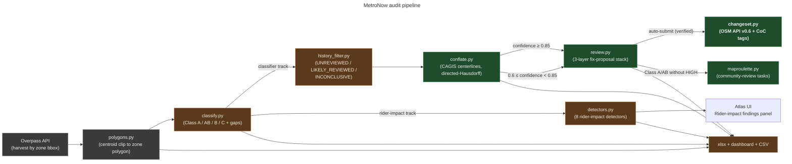
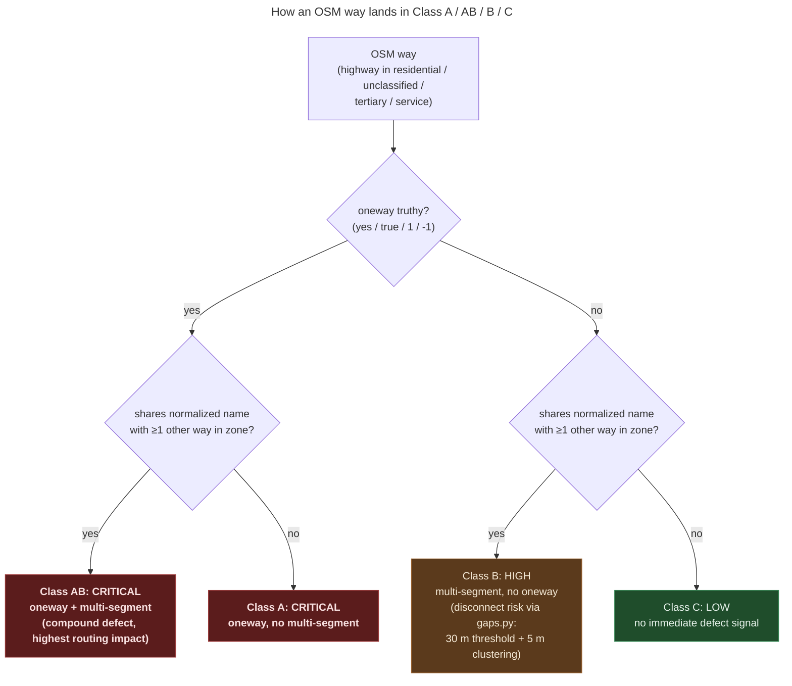
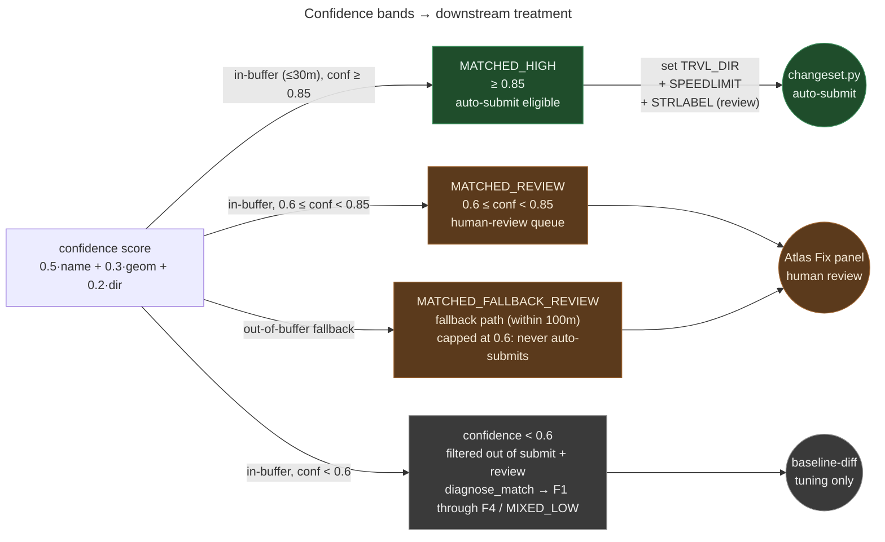

# MetroNow

**Summary.** OSM road-defect detection and correction pipeline for the
four Hamilton County zones served by SORTA's [MetroNow](https://www.go-metro.com/metronow)
on-demand microtransit service. Via Transportation's ViaMapping
routing layer is built on OpenStreetMap: defects in OSM propagate,
on Via's next ingest, into the routing tiles every MetroNow trip
relies on. The pipeline harvests candidate defects from Overpass,
classifies them with a TIGER-fixup taxonomy, ground-truths a subset
against the Cincinnati Area GIS (CAGIS) Open Data Hub, and submits
verifiable corrections back to OSM via OAuth 2.0 changesets with
full community compliance.

---

## What this is

The 2007-2008 TIGER/Line bulk import (`DaveHansenTiger`) seeded a
generation of defects in OSM's Hamilton County coverage: false
`oneway=yes` on residential streets, over-connected intersections at
grade separations, `highway=residential` defaults that should have
been `unclassified` or `tertiary`. Subsequent cleanup bots stripped
the diagnostic `tiger:reviewed=no` and `tiger:cfcc` markers from a
non-trivial fraction of ways without correcting the underlying
geometry.

Defects in OSM propagate, after Via's next ingest cycle, into the
routing tiles consumed by every MetroNow trip: refused turns,
circuitous detours, "no service available" responses on real public
streets, ETAs derived from misclassified highway types. The pipeline
finds those defects regardless of whether the TIGER provenance markers
survive, ground-truths a subset against authoritative CAGIS centerlines,
and submits verifiable corrections under the OSM
[Automated Edits code of conduct](https://wiki.openstreetmap.org/wiki/Automated_Edits_code_of_conduct).

## How it works

Seven pipeline stages, each implemented as a module under `src/osm/`:



The pipeline emits two parallel tracks. The **classifier track**
(Class A / AB / B / C plus gaps) is the only path to mechanical
auto-submission. The **detector track** (eight rider-impact checks)
ships findings to the UI for human triage; it never reaches
`changeset.py`. This split is the project's mechanical-edit safety
perimeter: see [`docs/explainers/detector-taxonomy.md`](docs/explainers/detector-taxonomy.md).

## Defect taxonomy (classifier track)



The classifier emits one terminal class per way. Class B's
multi-segment grouping additionally feeds haversine-based
node-disconnect detection in `src/osm/gaps.py` (30 m proximity
threshold, 5 m junction clustering). See
[`docs/explainers/detector-taxonomy.md`](docs/explainers/detector-taxonomy.md)
for the full classifier-vs-detector decomposition.

## Rider-impact detectors

Eight detectors operate over the harvested ways, nodes, and
relations. Each finding carries a `routing_impact` score; nothing
on this track auto-submits. Findings land in the Atlas Fix panel
for human triage, and — when expected false-positive rate exceeds
5% — optionally a MapRoulette challenge for community review. The
`_safe_run` wrapper in `classify.py` guarantees one broken
detector cannot kill the audit run.

### Impact 5 — blocks an arterial-class route

These are the rider-visible failures. A routing engine that hits
one returns *"no service available"* on a real public street, or
detours a passenger several blocks around a phantom barrier.

| Detector | Triggers on | Source |
|---|---|---|
| `oneway_conflicts` | Same-name parallel ways with same-direction `oneway`. A lateral-vs-longitudinal filter excludes divided carriageways where the parallel oneway is legitimate. | [`detectors.py:153`](src/osm/detectors.py#L153) |
| `access_blocked_residential` | `access` in `{no, private}` on `highway=residential`. Excludes `motor_vehicle=destination` — the gated-community pattern is intentional. | [`detectors.py:338`](src/osm/detectors.py#L338) |

### Impact 4 — degrades routing materially

Routing still completes, but at unnecessary cost. The most common
failure mode here is `oneway=-1` on suburban streets: modern
engines route it correctly, older planners break, and Via's ingest
doesn't tell us which it uses.

| Detector | Triggers on | Source |
|---|---|---|
| `oneway_minus_one` | `oneway=-1` on a Class A highway type. | [`detectors.py:118`](src/osm/detectors.py#L118) |
| `barriers_without_access` | `barrier` in `{gate, bollard, lift_gate, swing_gate, cycle_barrier}` without any of `access` / `motor_vehicle` / `bicycle` / `foot` set on the node. | [`detectors.py:443`](src/osm/detectors.py#L443) |
| `broken_turn_restrictions` | `relation[type=restriction]` missing a `from`, `via`, or `to` member, or carrying an empty `restriction` tag. | [`detectors.py:596`](src/osm/detectors.py#L596) |

### Impact 3 — misclassifies highway type

These don't block routing but inflate ETAs and degrade Via's
geofence accuracy. Both detectors are echoes of the TIGER import's
`highway=residential` default.

| Detector | Triggers on | Source |
|---|---|---|
| `arterial_named_residential` | `highway=residential` whose name ends in Boulevard / Parkway / Expressway / Pike / Highway / Crossing / Memorial. | [`detectors.py:375`](src/osm/detectors.py#L375) |
| `missing_maxspeed_arterial` | `highway` in `{tertiary, unclassified}` without a `maxspeed`. | [`detectors.py:407`](src/osm/detectors.py#L407) |

### Impact 2 — rider-facing but soft

| Detector | Triggers on | Source |
|---|---|---|
| `misplaced_bus_stops` | `highway=bus_stop` whose nearest drivable vertex is more than 20 m away. Cross-checked against SORTA GTFS stop positions before flagging. | [`detectors.py:475`](src/osm/detectors.py#L475) |

The Atlas UI sorts the combined finding stream by `routing_impact`
descending, so the rider-visible failures rise to the top of the
queue regardless of detector.

## Conflation against ground truth

`src/osm/conflate.py` matches every harvested OSM way against the
nearest Cincinnati Area GIS centerline using a three-term weighted
score:

```
confidence = 0.5 · name_similarity      (Ratcliff-Obershelp on normalized names)
           + 0.3 · geometry_overlap     (1 − directed-Hausdorff/30 m, OSM→CAGIS only)
           + 0.2 · direction_alignment  (|cos θ| between line direction vectors)
```

The geometry term uses **directed** Hausdorff (max-over-OSM-points
of min-distance-to-CAGIS). The symmetric form blew up on the common
topology where OSM has a long named street broken into shorter ways
at intersections: see [`docs/explainers/conflation-matcher.md`](docs/explainers/conflation-matcher.md).



The nearest-neighbor fallback (when STRtree returns no in-buffer
candidates) is hard-capped at `REVIEW_CONFIDENCE`: fallback hits
populate human review but **never** auto-submit. This is the
project's epistemic gate: any edit submitted to OSM as a mechanical
edit must clear 0.85 against an authoritative external source.

## Service zones

| Zone key | Communities served |
|---|---|
| `blue-ash-montgomery` | Blue Ash, Montgomery, Deer Park, Silverton, Kenwood, Madeira |
| `springdale-sharonville` | Springdale, Sharonville, Glendale, Evendale, Lincoln Heights |
| `northgate-mt-healthy` | Mt. Healthy, North College Hill, Finneytown, Northgate |
| `forest-park-pleasant-run` | Forest Park, Pleasant Run, Greenhills |

Zone polygons are extracted from SORTA's published web map and stored
under [`src/osm/zones/<zone-key>.geojson`](src/osm/zones/); see
[`docs/explainers/zone-data-flow.md`](docs/explainers/zone-data-flow.md)
for why the bbox-and-polygon split is load-bearing (Forest Park's bbox
bleeds 1 km north into Butler County, producing a 78%
`F1_NO_CANDIDATE` rate pre-clip — these are ways with no CAGIS
match because CAGIS coverage stops at the county line, not because
the OSM geometry was wrong).

## Quickstart

Requires Python 3.12+ and Node.js 20+. Shapely 2.0+ is required for
conflation; if absent, the rest of the pipeline still runs and
conflation degrades to a no-op with a warning.

```bash
pip install -e ".[dev]"
cd web && npm install && npm start
```

Open `http://localhost:3000`.

CLI usage:

```bash
osm scan --zone blue-ash-montgomery                    # standard scan
osm scan --zone blue-ash-montgomery --with-conflation  # add CAGIS ground truth
osm scan --zone all                                    # all four zones
osm conflate --zone blue-ash-montgomery                # conflate against existing scan
osm preflight --zone blue-ash-montgomery               # 17 readiness checks
osm fix --zone blue-ash-montgomery --dry-run           # preview corrections
osm fix --zone blue-ash-montgomery                     # submit changesets
osm auth login                                         # OSM OAuth 2.0 + PKCE
```

The full subcommand reference (17 commands across 6 lifecycle stages)
lives in [`docs/cli-reference.md`](docs/cli-reference.md).

## Compliance and provenance

Every changeset must comply with the OSM
[Automated Edits code of conduct](https://wiki.openstreetmap.org/wiki/Automated_Edits_code_of_conduct):

- Edits must be documented in advance on a wiki page (the changeset's
  `description` tag links to it).
- Discussion on `talk-us@` and `community.openstreetmap.org` is
  required, with a 14-day comment window before bulk runs.
- Changesets are tagged `mechanical=yes`, `bot=yes`, and carry the
  project source attribution.
- Opt-out requests are honored immediately.
- Changesets stay well below the 10,000-element CGImap limit; the
  project default is ≤ 500 elements per batch to keep diff review
  tractable in OSMCha.

CAGIS data is used "as is" per the Open Data Hub license; attribution
is written into every CAGIS-sourced changeset via the
`cagis:attribution` tag. The four-step Phase 1 community-gating
sequence (Minh outreach → `_cincyimport` account → wiki page →
talk-us@ post + 14-day window) is documented in detail in
[`docs/explainers/osm-community-gating.md`](docs/explainers/osm-community-gating.md);
paste-ready drafts live under [`docs/community-prep/`](docs/community-prep/).

## Project documentation

Five surfaces, by audience.

**[`CLAUDE.md`](CLAUDE.md)** is the dense context manifest — the
source of truth for architecture, conventions, and phase status,
optimized for fast loading by AI sessions on cold re-entry.

**[`docs/glossary.md`](docs/glossary.md)** is the color-coded
reference for every project-specific term, OSM tag, and
authoritative source. Skim once after a long absence, then point
at it whenever a section assumes you know the jargon.

**[`docs/explainers/`](docs/explainers/)** holds 13 decompression
docs that unpack the dense `CLAUDE.md` sections. One topic per
file, each following the same template: summary → bridge steps →
load-bearing diagram → `file:line` citations.

> detector-taxonomy · conflation-matcher · osm-community-gating · phase-status · zone-data-flow · routing-engine-dispatch · conventions · oauth-pkce-flow · history-filter · preflight-checks · maproulette-tasks · transit-quota · external-feeds

**[`docs/skills/`](docs/skills/)** holds 14 short companions to
`.claude/skills/`, sized for re-entry rather than first read.

> zone-audit · cagis-conflate · ground-truth-diff · tiger-history-deep · osmcha-monitor · community-prep · changeset-submit · maproulette-challenge · metronow-{code,javascript,html,css,dockerfile}-review · metronow-explainer

**Codebase-area overviews** sit alongside the explainers:
[`docs/cli-reference.md`](docs/cli-reference.md) (17 `osm`
subcommands by lifecycle stage),
[`docs/tests-overview.md`](docs/tests-overview.md) (pytest layout,
what's tested vs deliberately not),
[`docs/web-architecture.md`](docs/web-architecture.md) (Express +
vanilla SPA + shell-out-to-Python),
[`docs/sources.md`](docs/sources.md) (external-source evaluation log).

The four-step Phase 1 community-gating sequence ships paste-ready
in [`docs/community-prep/`](docs/community-prep/) (`00-README`
through `05-transit-api-compliance`).

## Background

Successor to [AICincy/Tiger](https://github.com/AICincy/Tiger),
which detected defects via the now-deprecated `tiger:reviewed=no`
filter. Per community feedback from
[Minh Nguyễn](https://wiki.openstreetmap.org/wiki/User:Mxn), that
tag is unreliable in both directions: cleanup bots strip it without
fixing the geometry, and human mappers leave it in place after
correcting the data. This pipeline replaces the single-tag heuristic
with a union query (TIGER origin marker ∪ defect signature), layered
with eight rider-impact detectors that operate independently of
TIGER provenance, and grounded against CAGIS Street Centerlines for
verifiable mechanical fixes.

[`RESEARCH-FINDINGS.md`](RESEARCH-FINDINGS.md) holds the full
investigation into Via's data architecture, the TIGER defect
taxonomy, the OSM API v0.6 constraints, and the OSM community
process requirements. Read it before opening a PR that changes the
defect detectors or the changeset submission path.

## See also

- [`CLAUDE.md`](CLAUDE.md): project context manifest.
- [`docs/glossary.md`](docs/glossary.md): every project-specific
  term, OSM tag, authoritative source, and workflow concept,
  color-coded by category (🔴 critical / 🟡 review / 🟢 ground-truth /
  🔵 declarative / ⚪ informational).
- [`docs/explainers/detector-taxonomy.md`](docs/explainers/detector-taxonomy.md): the dual-track classifier vs detector design.
- [`docs/explainers/conflation-matcher.md`](docs/explainers/conflation-matcher.md): directed-Hausdorff scoring + asymmetric-promotion alert.
- [`docs/explainers/osm-community-gating.md`](docs/explainers/osm-community-gating.md): the four-step Phase 1 gating in dependency order.
- [`docs/cli-reference.md`](docs/cli-reference.md): every `osm` subcommand.
- **Open data attribution:** data © OpenStreetMap contributors (ODbL); data © Cincinnati Area GIS / Hamilton County, Ohio (Open Data Hub).

## License

[MIT](LICENSE).
