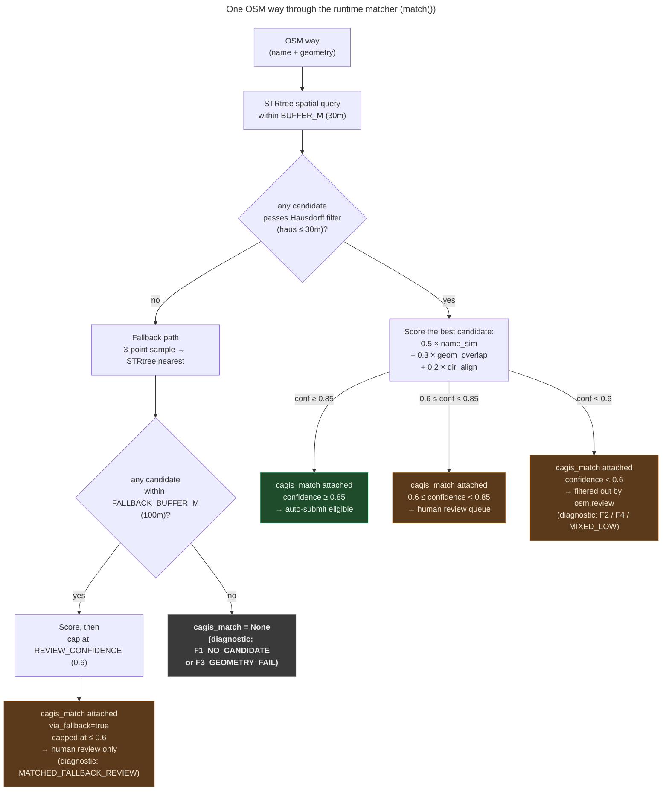

# Conflation matcher: directed-Hausdorff scoring against CAGIS

**Summary.** *Conflation* is the act of matching one geospatial dataset
against another to attach authoritative attributes (here: matching each OSM
way to its CAGIS centerline so we know the canonical name, oneway, functional
class, and speed limit). MetroNow's matcher scores every OSM way against
nearby CAGIS centerlines on three weighted signals: name (0.5), geometry
(0.3), direction (0.2): and lands each way in one of eight buckets. The two
load-bearing design choices are (a) the geometry term uses *directed* (not
symmetric) Hausdorff distance, and (b) the nearest-neighbor fallback is
hard-capped below the auto-submit threshold so it can populate human review
but never auto-submit.

---

## What this is

A *match* is a triple (OSM way, CAGIS centerline, confidence). The matcher
takes every way in a scan and either attaches a `cagis_match` dict to it or
sets `cagis_match = None`. Downstream, `osm.review.proposed_fixes_for_way`
reads each way's `cagis_match` to decide whether a Class A/AB fix can be
upgraded from "heuristic" to "CAGIS-verified" and graduated to the
auto-submit pool (see `docs/explainers/detector-taxonomy.md`).

The matcher uses three signals, all normalized to [0.0, 1.0]:

- **Name similarity**: string similarity between the normalized OSM
  `name` tag and the CAGIS `STRLABEL`. Weight: `W_NAME = 0.5`.
- **Geometry overlap**: `1.0 − (directed_hausdorff_m / BUFFER_M)`,
  clamped to [0, 1]. Weight: `W_GEOMETRY = 0.3`.
- **Direction alignment**: cosine of the unit-vectors of the two lines.
  Weight: `W_DIRECTION = 0.2`.

A match's `confidence` is the weighted sum. Two thresholds split the
confidence range into three operational bands:

- `confidence ≥ HIGH_CONFIDENCE (0.85)` → auto-submittable by
  `osm.review.proposed_fixes_for_way`.
- `REVIEW_CONFIDENCE (0.6) ≤ confidence < 0.85` → surfaces in the
  human-review queue.
- `confidence < 0.6` → the `cagis_match` dict is still attached to the
  way (the matcher emits a result for any candidate that clears
  Hausdorff, regardless of weighted score), but downstream
  `osm.review` filters it out of both the auto-submit and human-review
  queues. The `diagnose_match()` baseline pass classifies these into
  `F2_NAME_FAIL` / `F4_DIRECTION_DRAG` / `MIXED_LOW` for diff tracking.

The thresholds gate the *use* of the match, not whether the match is
recorded. They are the project's *epistemic gate*: any edit submitted to
OSM as a mechanical edit must clear 0.85 against an authoritative
external source. Anything weaker requires a human looking at it. This
is what keeps the `_cincyimport` account defensible to OSM admins.

## How it works

Per-way matching, called once per scan from `web/server.js:419-431`
(`POST /api/conflate/:zone`) and `cli.py:606-637` (`osm conflate --zone`):

1. **STRtree spatial query.** Build a Shapely STRtree over all CAGIS
   centerlines once per zone ([conflate.py:1089](../../src/osm/conflate.py#L1089),
   `build_index()`). For each OSM way, query the index for centerlines whose
   bounding box intersects the way's buffer at `BUFFER_M = 30.0` metres.
2. **Score every in-buffer candidate.** For each candidate centerline,
   compute directed Hausdorff distance OSM→CAGIS
   ([conflate.py:512](../../src/osm/conflate.py#L512)). Reject if
   `haus > BUFFER_M`. Otherwise compute name + geometry + direction
   signals and the weighted confidence
   ([conflate.py:520-524](../../src/osm/conflate.py#L520-L524)).
3. **Pick the best candidate.** Highest confidence wins
   ([conflate.py:525-526](../../src/osm/conflate.py#L525-L526)).
4. **If no candidate cleared the Hausdorff filter, try the fallback.**
   This happens either when STRtree returns no candidates within
   `BUFFER_M`, or (rarely with the directed metric) when all
   in-buffer candidates have `haus > BUFFER_M` ([conflate.py:497-508,
   528-538](../../src/osm/conflate.py#L497-L538)).
   `_fallback_score()` ([conflate.py:545](../../src/osm/conflate.py#L545))
   samples three OSM vertices (first / middle / last), looks up each one's
   absolute nearest CAGIS centerline via `STRtree.nearest`, and accepts
   any candidate whose directed Hausdorff is within
   `FALLBACK_BUFFER_M = 100.0` metres.
5. **Cap the fallback at REVIEW_CONFIDENCE.**
   ([conflate.py:605](../../src/osm/conflate.py#L605):
   `confidence = min(raw_confidence, REVIEW_CONFIDENCE)`). A fallback match
   can populate the human-review queue at any confidence ≤ 0.6, but it can
   never reach 0.85, no matter how good the underlying signals are. This is
   the safety property that distinguishes a "we found something nearby"
   match from a "we matched the right centerline" match.
6. **Attach `cagis_match` to the way.**
   ([conflate.py:1125](../../src/osm/conflate.py#L1125):
   `w["cagis_match"] = m`). The dict shape is built by
   `_build_match_result()` ([conflate.py:610-635](../../src/osm/conflate.py#L610-L635))
   and includes `cagis_id`, `cagis_name`, `cagis_oneway`,
   `cagis_functional_class`, `cagis_speed_limit`, `confidence`,
   `name_similarity`, `hausdorff_m`, `name_match`, and `via_fallback`.

Every way in the scan ends in exactly one of eight buckets, defined as
constants at
[conflate.py:114-122](../../src/osm/conflate.py#L114-L122):

| Bucket | Meaning |
|---|---|
| `MATCHED_HIGH` | confidence ≥ 0.85 → auto-submittable |
| `MATCHED_REVIEW` | 0.6 ≤ confidence < 0.85, in-buffer → human queue |
| `MATCHED_FALLBACK_REVIEW` | fallback path matched, capped at 0.6 |
| `F1_NO_CANDIDATE` | nothing within `FALLBACK_BUFFER_M` either |
| `F2_NAME_FAIL` | geometry passes, name similarity < 0.5 |
| `F3_GEOMETRY_FAIL` | candidates exist, all `haus > BUFFER_M` |
| `F4_DIRECTION_DRAG` | short way, direction term killed an otherwise-passing match |
| `MIXED_LOW` | confidence < 0.6, no single dominant cause |

Bucket assignment for diagnostic runs happens in
`diagnose_match()` ([conflate.py:637-837](../../src/osm/conflate.py#L637-L837));
the runtime matcher only emits the `MATCHED_*` buckets via `cagis_match`, but
diagnostic baselines emit all eight.

## The flow, visually

*What this shows: the runtime matcher's actual outcomes. Every way ends
up with either a `cagis_match` dict (with one of four downstream
treatments based on `confidence` and `via_fallback`) or `cagis_match =
None`. The only path to auto-submit is the in-buffer scoring path with
confidence ≥ 0.85. F1 through F4 and MIXED_LOW are diagnostic-only buckets
computed retrospectively by `diagnose_match()` during baseline runs;
they are noted in parentheses on the runtime states they correspond to.
What this hides: the nine-field `cagis_match` dict shape, the STRtree
build cost, the rare in-buffer-but-all-fail-Hausdorff path that also
falls through to fallback, and the shapely-optional graceful-degradation
path.*

## Why directed Hausdorff was load-bearing

The single change from symmetric to directed Hausdorff lifted the
auto-submit pool from ~5.0% of ways to ~12.1%. The matcher source
file embeds the rationale verbatim
([_geometry.py:218-231](../../src/osm/_geometry.py#L218-L231)):

> One-sided Hausdorff in metres: OSM way → source polyline only.
>
> Computes max-over-OSM-points of min-distance-to-source-line. Unlike the
> symmetric form, this rewards the common topology where the OSM way is a
> *fragment* of a longer authoritative centerline (CAGIS street spans the
> whole named street; OSM has it broken into several ways at
> intersections). The symmetric metric blew up on the reverse direction in
> that case: every CAGIS endpoint outside the OSM segment counted against
> the score even though the OSM way perfectly traced its part.
>
> Phase 2a baselines across all four MetroNow zones attributed 70.5% of
> unmatched ways to F3 (symmetric Hausdorff > BUFFER_M).

In other words: OSM models a named street as a chain of small ways broken
at every intersection; CAGIS models it as one long centerline. Symmetric
Hausdorff computed `max(d(OSM→CAGIS), d(CAGIS→OSM))` and the second
direction was dominated by all the CAGIS endpoints far away from the small
OSM fragment, even when the OSM fragment perfectly traced its portion of
the centerline. Switching to directed (`d(OSM→CAGIS)` only) accepts these
fragments as legitimate sub-segments, which they are.

This is the kind of design decision that's easy to lose between sessions:
the constants stay tuned, the function looks right, but the *insight*:
that OSM topology and CAGIS topology disagree about what a "street" is, and
the metric has to acknowledge that: is the load-bearing piece. If a future
session reverts to symmetric to "fix" something else, the auto-submit pool
collapses without obvious cause.

## Operational observability: baseline-diff

The matcher is tunable. A change to weights, thresholds, or the
similarity function is supposed to *improve* the F3 (geometry-fail) bucket
by recovering real matches: not to inflate `MATCHED_HIGH` by lowering the
bar. To distinguish these, every conflation run can write a *baseline
manifest* via `osm conflate --zone <key> --diagnose --write-baseline`,
and the `osm baseline-diff` command compares two baselines:

1. **Write baselines**: `diagnose_all()`
   ([conflate.py:854](../../src/osm/conflate.py#L854)) walks every way and
   assigns one of the eight buckets via `diagnose_match()`. The result is
   serialized by `write_baseline_manifest()`
   ([conflate.py:923](../../src/osm/conflate.py#L923)) under
   `osm-audit-<zone>/data/baselines/`.
2. **Compare two baselines**: `osm baseline-diff`
   ([cli.py:991](../../src/osm/cli.py#L991)) loads two manifests with
   `load_baseline_manifest()` and runs `diff_baselines()`
   ([conflate.py:986-1069](../../src/osm/conflate.py#L986-L1069)).
3. **Asymmetric-promotion alert.** The diff fires an alert when
   `MATCHED_HIGH` *grows* between the two runs but the growth is sourced
   from `MATCHED_REVIEW` *shrinking* rather than from `F3_GEOMETRY_FAIL`
   shrinking. The plain-English version: "you boosted the auto-submit
   count by promoting borderline cases, not by fixing more geometry."
   This is exactly the kind of unconscious tuning regression that gets
   accounts banned at scale.
4. **Auto-discover the two most recent.** `newest_two_manifests()`
   ([conflate.py:1072-1086](../../src/osm/conflate.py#L1072-L1086))
   defaults the diff to the two most recent baselines by mtime, so the
   common case is `osm baseline-diff --zone blue-ash-montgomery` with no
   explicit paths.

## Edge cases and gotchas

- **Fallback is a hard cap, not a tiebreaker.** A way matched only via
  fallback can never auto-submit, regardless of how high the raw
  confidence would have been. The cap at
  [conflate.py:605](../../src/osm/conflate.py#L605) is the project's
  uncertainty discipline made visible in code.
- **Fallback samples three points, not the full polyline.** `STRtree.nearest`
  is called once each for the first / middle / last vertex
  ([conflate.py:569-573](../../src/osm/conflate.py#L569-L573)). Single-vertex
  sampling missed valid matches on long curved ways where the first
  vertex's nearest centerline diverged from the rest of the way's
  ([conflate.py:558-564](../../src/osm/conflate.py#L558-L564): a fix
  pointed out in a PR #11 review).
- **Shapely is optional.** No shapely available → `build_index()` returns
  an empty stub, `match_way()` returns `None` for everything, and
  `cagis_match` is set to `None` for every way
  ([conflate.py:1118-1121](../../src/osm/conflate.py#L1118-L1121)). The
  rest of the pipeline (scan, classify, detector track, UI) still works.
  Documented in the module docstring at
  [conflate.py:1-17](../../src/osm/conflate.py#L1-L17).
- **`F4_DIRECTION_DRAG` is short-way-specific.** The F4 attribution only
  fires when the OSM way is shorter than `DIAG_SHORT_WAY_M = 50.0` metres.
  Short ways have noisy direction signals because a 5-vertex polyline can
  twist enough to push direction alignment below 0.5 even when the way is
  clearly the right street. The bucket says "we *would* have matched
  except direction dragged the score below the bar."
- **Name similarity has a threshold of its own.**
  `DIAG_NAME_FAIL_THRESHOLD = 0.5` is the cutoff for the F2 attribution.
  Below that, the matcher concludes the geometry is plausible but the
  names disagree (e.g., a TIGER residual still labeled "Old Mason Road"
  while CAGIS has been updated to "Mason Road").
- **The conflation cache is 90 days.** CAGIS centerlines are cached at
  `~/.config/osm/cagis_cache/centerlines-{hash}.geojson`. Pass
  `force_refresh=True` to `load_cagis_for_zone()` to bypass.
- **`cagis:attribution` tag is mandatory on changesets.** Per the CAGIS
  Open Data Hub license, every changeset that uses CAGIS evidence must
  carry the attribution tag. The constant is at
  [conflate.py:76-79](../../src/osm/conflate.py#L76-L79); the changeset
  builder reads it.

## Code references

- [`src/osm/conflate.py:1-17`](../../src/osm/conflate.py#L1-L17): module
  docstring, including the shapely-optional graceful-degradation note.
- [`src/osm/conflate.py:82-112`](../../src/osm/conflate.py#L82-L112):
  threshold + weight constants, including the rationale comments for
  `FALLBACK_BUFFER_M` and `DIAG_*` thresholds.
- [`src/osm/conflate.py:114-122`](../../src/osm/conflate.py#L114-L122):
  the eight bucket constants.
- [`src/osm/conflate.py:309`](../../src/osm/conflate.py#L309):
  `load_cagis_for_zone()` (public API; called from `web/server.js:348`
  and `cli.py:248`).
- [`src/osm/conflate.py:497-508`](../../src/osm/conflate.py#L497-L508):
  the in-buffer-vs-fallback dispatch.
- [`src/osm/conflate.py:512`](../../src/osm/conflate.py#L512):
  directed-Hausdorff call (normal path).
- [`src/osm/conflate.py:520-524`](../../src/osm/conflate.py#L520-L524):
  three-term scoring (`W_NAME × name + W_GEOMETRY × geom + W_DIRECTION × dir`).
- [`src/osm/conflate.py:545-608`](../../src/osm/conflate.py#L545-L608):
  `_fallback_score()` (3-point sample, hard cap at 605).
- [`src/osm/conflate.py:610-635`](../../src/osm/conflate.py#L610-L635):
  `_build_match_result()`: the dict shape attached to `cagis_match`.
- [`src/osm/conflate.py:637-837`](../../src/osm/conflate.py#L637-L837):
  `diagnose_match()`: F1 through F4 bucket assignment for baselines.
- [`src/osm/conflate.py:854`](../../src/osm/conflate.py#L854):
  `diagnose_all()`: baseline driver.
- [`src/osm/conflate.py:923`](../../src/osm/conflate.py#L923):
  `write_baseline_manifest()`.
- [`src/osm/conflate.py:986-1069`](../../src/osm/conflate.py#L986-L1069):
  `diff_baselines()`, including the asymmetric-promotion alert.
- [`src/osm/conflate.py:1089`](../../src/osm/conflate.py#L1089):
  `build_index()` (public API).
- [`src/osm/conflate.py:1113-1129`](../../src/osm/conflate.py#L1113-L1129):
  `conflate()` (public API; line 1125 sets `cagis_match`).
- [`src/osm/_geometry.py:214-237`](../../src/osm/_geometry.py#L214-L237):
  `directed_hausdorff_meters()` and the docstring justifying it.
- [`src/osm/cli.py:590-667`](../../src/osm/cli.py#L590-L667): the
  `osm conflate` CLI command.
- [`src/osm/cli.py:991-1070`](../../src/osm/cli.py#L991-L1070): the
  `osm baseline-diff` CLI command.
- [`web/server.js:419-431`](../../web/server.js#L419-L431): the
  `POST /api/conflate/:zone` handler.

## See also

- [`CLAUDE.md` § Conflation matcher state](../../CLAUDE.md): the dense
  source statement this explainer decompresses.
- [`docs/explainers/detector-taxonomy.md`](detector-taxonomy.md): where
  `cagis_match` is read by `proposed_fixes_for_way` to graduate Class A/AB
  fixes from heuristic to CAGIS-verified.
- [CAGIS Open Data Hub](https://cagisonline.hamilton-co.org/cagisonline/):
  the source of the authoritative centerlines, with license terms.
- [OSM wiki: Conflation](https://wiki.openstreetmap.org/wiki/Conflation):
  general background on the practice.
