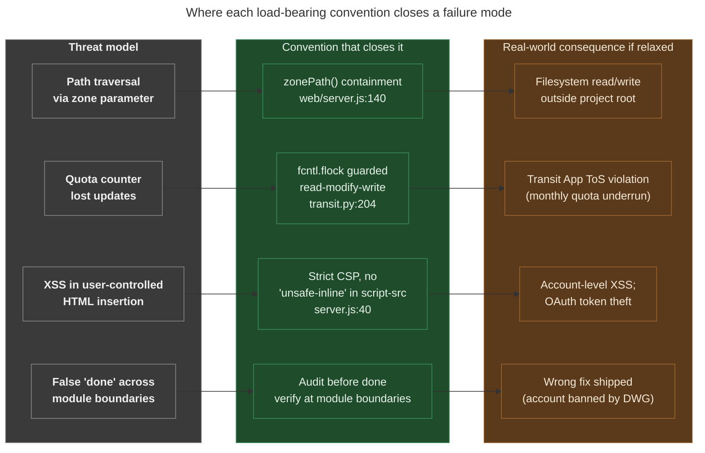

# Conventions: load-bearing rules and the failure modes they close

**Summary.** MetroNow's `## Conventions` section in `CLAUDE.md` lists
seven rules: hyphens-not-underscores in filenames, no CLI instructions
to the user, auto-mode-by-default, audit-before-done, `zonePath()`
containment guard, `fcntl.flock` for concurrent file mutators, and
strict-CSP-via-helmet-with-no-`unsafe-inline`-in-`script-src`. The first
three are stylistic; the last four are **load-bearing**: each one
closes a specific failure mode that has either bitten the project or
been caught in pre-merge review. This explainer separates which rules
are which, names the failure modes the load-bearing ones close, and
points at the code that implements them.

---

## What this is

Conventions are the project's defaults for "how we do things here." Most
projects' conventions are stylistic (where the brace goes, how to name a
function). MetroNow has those too, but four of its conventions are
*defenses*: they close specific classes of bug or compliance failure
that have shown up in practice. Knowing which rule is which matters
because:

- A stylistic convention can be relaxed for a good reason. If you want
  to use snake_case in a single file because it imports cleaner from
  some upstream, you can.
- A load-bearing convention cannot. Relaxing it reintroduces the
  failure mode the rule was added to close: usually quietly, often
  catastrophically.

The seven conventions below are split into the two categories so
future-you doesn't accidentally relax the wrong one.

## How it works: the seven rules

### Stylistic (preference, can be relaxed for cause)

1. **Hyphens, never underscores in filenames.** Project-wide. Applies
   to source files (`route_diff.py` is the only intentional exception
  : Python's import system requires underscores in module names),
   docs, scripts, fixtures, zone GeoJSONs. The rule keeps file lists
   readable and avoids shell-escape friction with double-clicked
   filenames. Style preference; if a tool requires underscores, use
   them.
2. **No CLI instructions to the user: run everything directly.**
   When a doc would say "now run `osm scan --zone blue-ash-montgomery`,"
   instead the doc just *runs it* via Bash and reports results. This
   is an assistant-style preference: the maintainer doesn't want a
   wall of "now type this" commands; they want the output. Style.
3. **Auto mode is the default: make decisions, don't present menus.**
   When the agent would otherwise ask "do you want A, B, or C?", pick
   the most reasonable option and explain after. Saves round-trips on
   a solo-maintained project. Style.

### Load-bearing (closes a specific failure mode; do not relax)

4. **Audit work before declaring done: verify at module boundaries
   and spot-check outputs against known data.** *Failure mode:* false
   "done" reports where the code looked right but the integration was
   broken (e.g. a fix that classified correctly but never reached the
   review queue because of a misnamed dict key). *How to honor:* trace
   data through `fetch → classify → conflate → review → changeset` end
   to end before saying "shipped." Spot-check against an
   `index-case-street` from `ZONES` (e.g. O'Leary Avenue in Blue Ash).
5. **`zonePath()` containment guard for every per-zone path
   construction in `web/server.js`.** *Failure mode:* path-injection
   exploits where a malicious `zone` parameter could escape the
   project root and read or write arbitrary filesystem locations.
   *How to honor:* every per-zone path goes through
   [`zonePath()`](../../web/server.js#L140), which uses
   `path.resolve` to normalize and then asserts the resolved path
   starts with `PROJECT_ROOT + path.sep`. CodeQL's
   `js/path-injection` sink-based analysis flags every call site
   that bypasses this; the guard satisfies it at every site.
6. **Concurrent file mutators hold an exclusive `fcntl.flock` on
   POSIX, with an explicit unlocked-fallback path on Windows.**
   *Failure mode:* a CLI scan and a web-server-triggered scan both
   incrementing the Transit App quota counter at the same time, each
   reading the count, each writing count+1, the second write losing
   the first's increment. The lost-update isn't a corruption: it's
   a *quota underrun*: the counter says 9,999 when 10,000 calls have
   actually been made, the next call goes through, and the project
   exceeds its monthly quota. That's a Transit App ToS violation,
   not an internal bug. *How to honor:* every concurrent file
   mutator uses the
   [`_increment_usage()`](../../src/osm/transit.py#L204) pattern:
   open a sibling `.lock` file, take `fcntl.LOCK_EX`, do the
   read-modify-write, release. Windows has no `fcntl`; the rule
   says explicitly to fall back to the unlocked path because
   "better than corrupting the counter on Linux for the sake of
   Windows symmetry."
7. **Strict CSP via `helmet`; `script-src` never includes
   `'unsafe-inline'`.** *Failure mode:* an XSS injection in any
   server-rendered HTML or in any user-provided string that ends
   up in `innerHTML` becomes script execution. *How to honor:* the
   `app.use(helmet({...}))` block at
   [`web/server.js:40-58`](../../web/server.js#L40-L58) declares an
   explicit allow-list per directive. `script-src` allows only
   `'self'` plus `unpkg.com` (the Leaflet CDN). `style-src` allows
   `'unsafe-inline'` because Leaflet injects inline styles for
   control overlays, but `script-src` does not: that's the
   load-bearing distinction. The frontend code further runs every
   user-string-into-`innerHTML` path through `escapeHtml()` (per
   `metronow-javascript-review` skill).

## The flow, visually

*What this shows: every load-bearing convention is a wall between a
known threat and a real-world consequence. Removing a wall doesn't
just degrade code style: it lets the consequence happen. What this
hides: the audit-trail-and-OSMCha-monitoring layer that catches
post-submission failures (different concern; see
`docs/explainers/osm-community-gating.md`).*

## Why "verify at module boundaries" is load-bearing

This one is tempting to dismiss as project process rather than a code
defense, and it is process. But it has the same shape as the others:
a known failure mode (false "done" reports), a specific defense
(end-to-end traces through the pipeline + spot-checks), a real
consequence (wrong-fix mechanical edits, account ban).

The pipeline boundaries are:
`fetch.py` → `classify.py` → `conflate.py` → `review.py` →
`changeset.py`. Each module's output is the next module's input. A
bug at a boundary (a renamed key, a type mismatch, a missing field)
typically lets unit tests pass: they test each module in isolation:
but corrupts the integration. The convention is to trace one real
input through all five modules end to end before signing off.

The `index-case-street` field in
[`ZONES`](../../src/osm/zones/__init__.py#L11-L37) exists to make
this concrete: Blue Ash / Montgomery has `"O'Leary Avenue"` as a
known-defective TIGER street. Running a scan, looking up O'Leary in
the classifier output, then in the conflation result, then in the
proposed-fix list, is the canonical end-to-end audit before declaring
the pipeline "fixed."

## Edge cases and gotchas

- **`route_diff.py` is the one underscore allowed in source.** Python
  module names use underscores by language requirement; renaming to
  `route-diff.py` would break imports. Within the file, internal
  identifiers follow normal Python conventions
  (`_polite_sleep`, `_format_lonlat`). The rule is "filenames in
  general"; Python modules are the exception.
- **`zonePath()` does not validate that the resulting file *exists*.**
  It only verifies the path is contained in `PROJECT_ROOT`. Existence
  checks (e.g. `fs.existsSync`) are still required at every call site,
  per the existing pattern.
- **`fcntl.flock` releases on process exit.** The lock acquired in
  `_increment_usage()` is process-local. If the process crashes
  mid-write, the lock is released by the kernel; the next process
  acquires cleanly. Don't try to add manual cleanup.
- **`'unsafe-inline'` in `style-src` is intentional and minimal.**
  Leaflet's control overlays inject inline styles. The CSP allows
  `style-src 'unsafe-inline'` but **not** `script-src 'unsafe-inline'`
  ([server.js:45-50](../../web/server.js#L45-L50)). Don't extend
  `'unsafe-inline'` to `script-src` to "make something work": fix
  the something instead.
- **CSP allow-list mirrors `web/public/index.html`.** When a new
  external origin is added to the frontend (a new tile server, a new
  CDN), the helmet config has to be updated *in lockstep*. Otherwise
  the page fails to load the resource and silently falls back to a
  broken state. The
  [server.js:26-39](../../web/server.js#L26-L39) comment block
  documents which directive each origin lives in.
- **The "Auto mode is the default" rule does not mean "skip
  confirmation for destructive operations."** Reversible local edits
  go without confirmation; force-pushes, branch deletions, mass
  rewrites, and anything that touches OSM still confirm. The
  CLAUDE.md system prompt's "executing actions with care" section is
  the canonical formulation.
- **CodeQL's `js/path-injection` sink list grows over time.** When
  CodeQL flags a new sink in `web/server.js` that didn't exist
  before, the right response is to route the new path through
  `zonePath()`, not to suppress the alert. CodeQL alert #4 was
  closed by exactly this pattern.

## Code references

- [`CLAUDE.md` § Conventions](../../CLAUDE.md): the dense source
  statement this explainer decompresses.
- [`web/server.js:140-149`](../../web/server.js#L140-L149):
  `zonePath()` implementation.
- [`web/server.js:26-58`](../../web/server.js#L26-L58): strict CSP
  comment block + `helmet` configuration.
- [`src/osm/transit.py:204-234`](../../src/osm/transit.py#L204-L234)
 : `_increment_usage()` with the `fcntl.flock` lock + unlocked
  fallback for non-POSIX.
- [`src/osm/zones/__init__.py:11-37`](../../src/osm/zones/__init__.py#L11-L37)
 : the `ZONES` dict with `index-case-street` for the
  audit-before-done pattern.

## See also

- [`CLAUDE.md` § Conventions](../../CLAUDE.md): the dense source
  reference.
- [`docs/explainers/osm-community-gating.md`](osm-community-gating.md):
  why the audit-before-done convention is also load-bearing for
  community standing (false "done" reports lead to bad changesets,
  which lead to account bans).
- `.claude/skills/metronow-javascript-review/SKILL.md`: frontend
  audit standards including the `escapeHtml()` requirement.
- `.claude/skills/metronow-dockerfile-review/SKILL.md`: container
  configuration auditing (CSP-adjacent concerns).
- [OWASP: Path Traversal](https://owasp.org/www-community/attacks/Path_Traversal):
  the threat `zonePath()` defends against.
- [MDN: Content Security Policy](https://developer.mozilla.org/en-US/docs/Web/HTTP/CSP):
  background for the strict-CSP rule.
