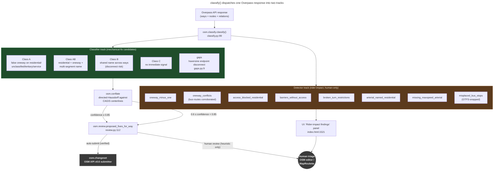

# Detector taxonomy — why two parallel tracks

**Summary.** MetroNow's `classify()` function emits two streams of defects
from a single Overpass response. The **classifier track** (Class A / AB / B /
C, plus node-disconnect gaps) produces candidates that may be auto-submitted
to OSM as mechanical edits. The **detector track** (eight rider-impact
checks) produces findings that ship to the UI for human triage and **never**
flow into the auto-submit pool. The split is the project's safety perimeter
— violating it is what gets a mechanical-edit account banned.

---

## What this is

A *defect* in MetroNow is anything in OSM that degrades MetroNow's routing
graph: a missing road, a wrongly-tagged one-way, a misplaced bus stop, a
broken turn restriction, a residential street that should be an arterial.
Defects come in two flavors:

1. **Mechanically correctable** — the OSM tags are demonstrably wrong
   against an authoritative external source (CAGIS centerlines, TIGER
   2024, OSM convention). A bot can propose the fix without judgment
   because the fix is literally "set tag X to value Y from source Z."
2. **Rider-impact, requires human judgment** — the tags may be wrong, or
   may be intentional, or fixing them might require restructuring an OSM
   relation. The defect affects routing, but the *fix* is not mechanical.

OSM's [Automated Edits Code of Conduct](https://wiki.openstreetmap.org/wiki/Automated_Edits_code_of_conduct)
treats mechanical edits and judgment edits very differently. Mechanical
edits need wiki documentation, list-discussion, and an `import`-suffix
account; judgment edits should not be batched at all. The taxonomy split
encodes this distinction in code so it cannot be accidentally violated.

## How it works

`classify()` runs both tracks in one pass over the Overpass response and
returns one dict containing both result sets. The downstream consumers
read different keys:

1. **Single entry, dual output.** `osm.classify.classify()`
   ([classify.py:99](../../src/osm/classify.py#L99)) builds Class A / AB /
   B / C buckets and gap candidates, *and* runs the eight rider-impact
   detectors. The two tracks share no code path beyond the Overpass parse.
2. **Classifier outputs:** `class_a`, `class_a_only`, `class_ab`,
   `class_b_streets`, `gaps`. These feed `osm.review.proposed_fixes_for_way`
   ([review.py:112-325](../../src/osm/review.py#L112-L325)) which produces three
   layers of fix proposals (heuristic → CAGIS-verified → TIGER-verified)
   and is the only path to `osm.changeset` (the OSM API submitter).
3. **Detector outputs:** `extra_findings`, populated at
   [classify.py:269-323](../../src/osm/classify.py#L269-L323) via eight
   `_safe_run` calls. The `_safe_run` wrapper ensures one broken detector
   cannot kill a scan run.
4. **UI consumption is segregated.** The web frontend pulls `extra_findings`
   into a separate "Rider-impact findings" panel
   ([index.html:1521](../../web/public/index.html#L1521),
   [server.js:386](../../web/server.js#L386),
   [server.js:453](../../web/server.js#L453)). There is no UI control
   that promotes a `extra_findings` row to the changeset queue.
5. **CAGIS conflation supplements the classifier track only.** When
   `osm.conflate` annotates a way with `cagis_match`, that match is read by
   `review.proposed_fixes_for_way` to upgrade a Class A/AB/B fix from
   "heuristic" to "CAGIS-verified" (auto-submittable at confidence ≥ 0.85).
   `extra_findings` rows do not carry `cagis_match` and cannot be
   upgraded.

## The flow, visually

*What this shows: every defect originates in `classify()`, but the two
output streams pass through different downstream modules. The auto-submit
edge from `Review` to `Changeset` only fires for CAGIS-verified
classifier-track fixes — there is no path from `DetectorTrack` to
`Changeset`. What this hides: the four-step CAGIS conflation matcher state
(F1–F4 buckets, directed-Hausdorff scoring) — see
`docs/explainers/conflation-matcher.md` once that exists.*

## Why this split is load-bearing

A mechanical edit applied to a rider-impact finding is the canonical
shape of an edit that gets reverted and gets an account
banned. Examples of what would go wrong if a detector finding were
auto-submitted:

- `oneway_minus_one` looks like a tagging mistake but is sometimes how a
  mapper expresses "one-way in the reverse direction of way drawing." A
  bot that flips it to `oneway=yes` reverses the road for routers that
  don't speak `-1`. CAGIS doesn't have an opinion either way.
- `arterial_named_residential` finds streets like "Reading Pike" tagged as
  `highway=residential`. The fix might be `highway=tertiary`, or it might
  be that the "Pike" suffix is historic and the road really is residential
  now. CAGIS centerlines won't tell you which.
- `broken_turn_restrictions` operates on OSM relations. Editing relations
  mechanically is a known footgun — a bot can corrupt the routing graph
  for a wide area in one bad changeset.

The classifier track avoids these traps because every Class A/AB/B fix is
either (a) heuristic and surfaced for human review, or (b) backed by a
CAGIS centerline match at ≥ 0.85 confidence. Both are defensible to OSM
admins inspecting a changeset.

## Edge cases and gotchas

- **Class C is not "all clear."** Class C is "we found no immediate
  defect signal." It does not mean the way is correct. It means the
  classifier had no signal — TIGER residuals tagged `highway=residential`
  with no oneway, no shared name, no gap. Spot-checks against CAGIS still
  catch defects in Class C ways.
- **Gaps are classifier-track but never auto-submitted.** `gaps` are
  proposed disconnects — they require a topology edit (move a node or
  add a connection), and topology edits are not in the mechanical-fix
  shape. They surface in the UI for MapRoulette task generation.
- **`extra_findings` can carry a `near_note` annotation.** When `osm_notes`
  is supplied to `classify()`, each detector finding gets enriched with the
  closest open OSM Note within `note_threshold_m` (default 50m). This is
  context for the human reviewer; it does not change the mechanical-fix
  gate.
- **One detector failing doesn't fail the run.** `_safe_run`
  ([classify.py:88-96](../../src/osm/classify.py#L88-L96)) wraps each
  detector in a try/except and returns `[]` on any exception. A scan with
  one broken detector still produces a complete classifier-track result.
- **Bus-route corroboration only feeds `oneway_conflicts`.** The CAGIS
  METRO Bus Routes feed (`osm.bus_routes`) is read once per scan and
  passed to the `detect_oneway_conflicts` detector to corroborate
  parallel-oneway false positives. No other detector and no classifier
  bucket consumes it.

## Code references

- [`src/osm/classify.py:99`](../../src/osm/classify.py#L99) —
  `classify()` entry point; both tracks dispatched here.
- [`src/osm/classify.py:88-96`](../../src/osm/classify.py#L88-L96) —
  `_safe_run` detector wrapper.
- [`src/osm/classify.py:269-323`](../../src/osm/classify.py#L269-L323) —
  the eight `extra_findings.extend(_safe_run(...))` calls.
- [`src/osm/detectors.py`](../../src/osm/detectors.py) — eight
  rider-impact detector implementations (one `def detect_*` per
  finding kind, lines 118 / 153 / 338 / 375 / 407 / 443 / 475 / 596).
- [`src/osm/gaps.py:9`](../../src/osm/gaps.py#L9) —
  `detect_gaps()` haversine-endpoint detector for the classifier track.
- [`src/osm/review.py:1-24`](../../src/osm/review.py#L1-L24) —
  three-layer fix-proposal stack; reads classifier outputs and CAGIS
  matches, never reads `extra_findings`.
- [`src/osm/conflate.py`](../../src/osm/conflate.py) — directed-Hausdorff
  matcher; supplements the classifier track only.
- [`web/server.js:386`](../../web/server.js#L386),
  [`:633`](../../web/server.js#L633) — REST handlers that lift
  `extra_findings` into the API response.
- [`web/public/index.html:1521`](../../web/public/index.html#L1521) —
  "Rider-impact findings" panel — the UI surface for `extra_findings`.

## See also

- [`CLAUDE.md` § Detector taxonomy](../../CLAUDE.md) — the dense
  source statement this explainer decompresses.
- `docs/community-prep/01-wiki-page.md` — the wiki page draft that
  declares to OSM what mechanical edits this account performs (and,
  by omission, what it does not).
- `.claude/skills/maproulette-challenge/SKILL.md` — how detector-track
  findings get crowdsourced when their false-positive rate exceeds 5%.
- [OSM Automated Edits code of conduct](https://wiki.openstreetmap.org/wiki/Automated_Edits_code_of_conduct)
  — the OSM-side policy that the dual-track design implements.
