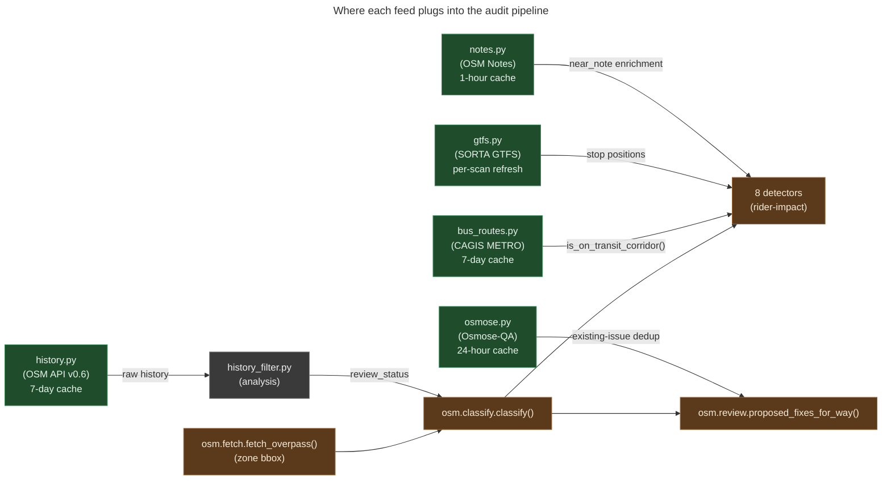

# External feeds — five read-only clients with shared design rules

**Summary.** Five modules under `src/osm/` consume external data
sources to enrich, corroborate, or deduplicate the audit pipeline's
output: `bus_routes.py` (CAGIS METRO Bus Routes), `gtfs.py` (SORTA
GTFS), `notes.py` (OSM Notes), `osmose.py` (Osmose-QA issues), and
`history.py` (OSM API v0.6 revision history). They share a common
shape — bbox-keyed disk cache, per-feed TTL, fail-open posture, OSM
User-Agent compliance — and differ in their authoritative role.
None of them write anywhere; all are strictly read.

---

## What this is

The classifier and detectors in `src/osm/` produce findings from
OSM-only data. Five external feeds lift that output by:

- **Corroborating** that a finding lies on a transit corridor
  (`bus_routes`) or near a bus stop position (`gtfs`).
- **Deduplicating** against community-reported defects already on
  record (`notes`, `osmose`).
- **Determining** whether the OSM way has been meaningfully reviewed
  since the TIGER import (`history` provides the raw revision history
  that `history_filter` analyses).

Each feed's role is read-only and offline-tolerant. If the feed is
unreachable, the call returns `None` / empty list and the rest of
the pipeline proceeds without that signal. No feed is on the critical
path of changeset submission.

## How they're organized

| Feed | Endpoint | Cache | TTL | Authoritative for |
|---|---|---|---|---|
| `bus_routes.py` | CAGIS ArcGIS Online item `af1e72d1373a4ceab400aa4fd2bc8173` (METRO Bus Routes) | `~/.config/osm/bus_routes_cache/` | 7 days | Transit-corridor corroboration for `oneway_conflicts` detector |
| `gtfs.py` | `https://www.go-metro.com/uploads/GTFS/google_transit_info.zip` (resolved via Mobility Database `mdb-366`) | `~/.config/osm/gtfs_cache/` | (in-memory per-process; refresh on each scan) | `misplaced_bus_stops` detector — validates `highway=bus_stop` nodes against actual GTFS stop positions |
| `notes.py` | `GET https://api.openstreetmap.org/api/0.6/notes.json?bbox=...` | `~/.config/osm/notes_cache/` | 1 hour | Surfaces existing community-reported problems on the same ways the pipeline flags |
| `osmose.py` | `GET https://osmose.openstreetmap.fr/api/0.3/issues?bbox=...&full=true` | `~/.config/osm/osmose_cache/` | 24 hours | Existing Osmose-QA issues on the same elements (avoid auto-submitting fixes the community already sees) |
| `history.py` | `GET https://api.openstreetmap.org/api/0.6/way/<id>/history.json` | `~/.config/osm/history_cache/<2-char hash>/` | 7 days | Per-way revision history; consumed by `history_filter.analyse_way_history()` |

## How they share design

Five rules that every feed module honors:

1. **Bbox-keyed disk cache.** Each feed's cache is one file per query
   bbox under `~/.config/osm/<feed>_cache/`. The cache key is a hash
   of `(bbox, params)` so equivalent queries hit the same file.
2. **TTL matched to source freshness.** GTFS / OSM Notes change
   minute-to-minute; CAGIS bus routes change quarterly at most. The
   per-feed TTLs reflect this — 1 hour for notes, 24 hours for
   osmose, 7 days for bus_routes and history, and (in-process only)
   for GTFS during a single scan run.
3. **Fail-open everywhere.** Any HTTP / JSON / connection error logs
   at warning level and returns `None` (or `[]`). The pipeline never
   sees an exception from a feed module. The audit can complete
   without any of these signals; they're enrichments, not gates.
4. **OSM User-Agent compliance.** Each feed sets a project-identifying
   `User-Agent` header on every request. Per OSM API operating norms,
   anonymous calls get rate-limited or blocked; the User-Agent is the
   identifier.
5. **Read-only.** No feed writes anywhere except its own cache. None
   call OSM API write endpoints. All four external services receive
   only `GET` requests.

## The flow, visually

*What this shows: each feed enriches a different stage of the
pipeline. `bus_routes` and `gtfs` feed the detector track;
`history` feeds `history_filter` which feeds `classify` retroactively;
`notes` enriches detector findings with a `near_note` annotation; and
`osmose` informs `review` so we don't propose fixes the Osmose-QA
project has already flagged. What this hides: the per-feed parsing
logic (CSV for GTFS, JSON for the others), the rate-limit dance with
the OSM API, and the way `bus_routes` feeds JUST the
`oneway_conflicts` detector, not the other seven.*

## Per-feed details

### `bus_routes.py` — CAGIS METRO Bus Routes

- **Source**: CAGIS ArcGIS Online item
  `af1e72d1373a4ceab400aa4fd2bc8173`, "METRO Bus Routes — Open Data,"
  owner `cagisopendata`. 202 features as of 2026-05.
- **Public API**: `fetch_bus_routes(zone)`
  ([bus_routes.py:91](../../src/osm/bus_routes.py#L91)) returns a list
  of `BusRoute` dataclasses;
  `is_on_transit_corridor(way, bus_routes)`
  ([bus_routes.py:175](../../src/osm/bus_routes.py#L175)) returns True
  if any bus route's polyline passes within ~50m of the way's
  midpoint.
- **Consumer**: `oneway_conflicts` detector in
  `src/osm/detectors.py:153`. The detector flags a way only when the
  conflict signal coincides with a transit corridor — a bus-corridor
  oneway error has materially higher rider impact than the same
  error on a residential side street.

### `gtfs.py` — SORTA GTFS feed

- **Source**: `google_transit_info.zip` from go-metro.com, resolved
  via Mobility Database catalog `mdb-366` (the public-feed-URL
  registry). SORTA Onestop ID
  `o-dngy-southwestohioregionaltransitauthority`, NTD ID 50012,
  Wikidata Q7571329.
- **Public API**: `fetch_sorta_stops()`
  ([gtfs.py:191](../../src/osm/gtfs.py#L191)) returns a list of
  `GtfsStop` dataclasses (stop_id, stop_name, lat, lon).
- **Consumer**: `misplaced_bus_stops` detector. A
  `highway=bus_stop` node in OSM is *valid* if it's near a real
  GTFS stop position; otherwise the OSM-side "nearest drivable
  vertex > 20m" signal makes it look misplaced when it isn't.
- **No persistent disk cache**: GTFS is parsed once per scan in
  memory; the zip download IS cached temporarily but the parsed
  stops aren't pickled.

### `notes.py` — OSM Notes

- **Source**: `GET https://api.openstreetmap.org/api/0.6/notes.json?bbox=...`
  (ODbL, no auth required for reads).
- **Public API**: `fetch_notes(bbox)`
  ([notes.py:108](../../src/osm/notes.py#L108)) returns parsed
  notes; `annotate_findings_with_notes(findings, notes,
  threshold_m=50.0)`
  ([notes.py:215](../../src/osm/notes.py#L215)) attaches the closest
  open note within threshold to each finding's `near_note` field.
- **Consumer**: `osm.classify.classify()` calls
  `annotate_findings_with_notes` over `extra_findings` when
  `osm_notes` is supplied. Per `docs/explainers/detector-taxonomy.md`,
  the `near_note` field is context for human review, not a gate.

### `osmose.py` — Osmose-QA

- **Source**: `GET https://osmose.openstreetmap.fr/api/0.3/issues?bbox=...&full=true&limit=N`
  (Osmose-QA project, ODbL-derived).
- **Public API**: `fetch_issues_for_zone(zone)`
  ([osmose.py:254](../../src/osm/osmose.py#L254)),
  `index_issues_by_osm_id(issues)`
  ([osmose.py:277](../../src/osm/osmose.py#L277)),
  `annotate_fixes_with_osmose(fixes, index)`
  ([osmose.py:301](../../src/osm/osmose.py#L301)).
- **Consumer**: `osm.review` consults the index when proposing fixes
  to avoid auto-submitting changes to elements the community already
  has eyes on.

### `history.py` — OSM API v0.6 revision history

- **Source**: `GET https://api.openstreetmap.org/api/0.6/way/<id>/history.json`
  (ODbL).
- **Public API**: `fetch_way_history(way_id)`
  ([history.py:48](../../src/osm/history.py#L48)),
  `batch_fetch_way_histories(ways)`
  ([history.py:146](../../src/osm/history.py#L146)),
  `extract_versions(history_data, element_type="way")`
  ([history.py:157](../../src/osm/history.py#L157)).
- **Consumer**: `osm.history_filter.analyse_way_history()` when its
  Tier 1 metadata check is ambiguous (see
  [`history-filter.md`](history-filter.md)).
- **Rate limit**: 0.5s between calls
  ([history.py:21](../../src/osm/history.py#L21)). The OSM API allows
  faster reads, but 0.5s is the project's politeness floor.

## Edge cases and gotchas

- **`bus_routes` only feeds `oneway_conflicts`.** The other seven
  detectors don't consult bus-routes data. If you write a new
  detector that benefits from transit-corridor context, plumb it
  in explicitly — there's no automatic cross-detector enrichment.
- **`gtfs` doesn't cache the parsed stops to disk.** GTFS feeds
  change frequently (schedule revisions, new stops, retired stops)
  and the parsed stops occupy modest memory. Parsing on each scan
  is the correct freshness/perf tradeoff. Don't add a disk-pickle
  layer.
- **`notes` returns CLOSED notes too unless filtered.** The
  `annotate_findings_with_notes` helper filters to `status=open`
  before matching. If you call `fetch_notes` directly, filter
  yourself.
- **`osmose` issues are Osmose's *suggestions*, not OSM truth.**
  Treat osmose's "this looks wrong" as a signal that the community
  is aware of a possible issue, not as a verified defect. Skipping
  fixes on osmose-flagged elements is the right default.
- **`history` rate-limits even cache hits.** The 0.5s sleep is
  unconditional. A bulk re-run hits the cache for every way but
  still pauses 0.5s between cache checks. This is intentional
  defensive design — if the cache invalidates mid-run, the
  half-second floor is already in place. Don't optimize this away.
- **All five feeds set the project User-Agent.** OSM's operational
  norms require it; anonymous calls get throttled or refused.
  Each feed module hardcodes the User-Agent string; if the
  project's identity changes, all five need updating.

## Code references

- [`src/osm/bus_routes.py:91`](../../src/osm/bus_routes.py#L91) —
  `fetch_bus_routes()`.
- [`src/osm/bus_routes.py:175`](../../src/osm/bus_routes.py#L175) —
  `is_on_transit_corridor()`.
- [`src/osm/gtfs.py:131`](../../src/osm/gtfs.py#L131) —
  `resolve_sorta_feed_url()` (Mobility Database catalog lookup).
- [`src/osm/gtfs.py:191`](../../src/osm/gtfs.py#L191) —
  `fetch_sorta_stops()`.
- [`src/osm/notes.py:108`](../../src/osm/notes.py#L108) —
  `fetch_notes()` bbox endpoint.
- [`src/osm/notes.py:215`](../../src/osm/notes.py#L215) —
  `annotate_findings_with_notes()`.
- [`src/osm/osmose.py:174`](../../src/osm/osmose.py#L174) —
  `fetch_issues()`.
- [`src/osm/osmose.py:301`](../../src/osm/osmose.py#L301) —
  `annotate_fixes_with_osmose()`.
- [`src/osm/history.py:21`](../../src/osm/history.py#L21) —
  `RATE_LIMIT_DELAY = 0.5`, `HISTORY_CACHE_TTL_DAYS = 7`.
- [`src/osm/history.py:48`](../../src/osm/history.py#L48) —
  `fetch_way_history()`.
- [`src/osm/history.py:146`](../../src/osm/history.py#L146) —
  `batch_fetch_way_histories()` (async via httpx).

## See also

- [`CLAUDE.md` § Layout / External feeds](../../CLAUDE.md) — the dense
  one-line entries this explainer decompresses.
- [`docs/explainers/detector-taxonomy.md`](detector-taxonomy.md) —
  where bus_routes, gtfs, and notes feed the rider-impact detectors.
- [`docs/explainers/history-filter.md`](history-filter.md) — how
  `history.py`'s output gets analysed.
- [`docs/explainers/transit-quota.md`](transit-quota.md) — Transit App
  is a SIXTH external feed but warrants its own explainer due to
  quota mechanics.
- [`docs/sources.md`](../sources.md) — the project's evaluation log
  for external sources.
