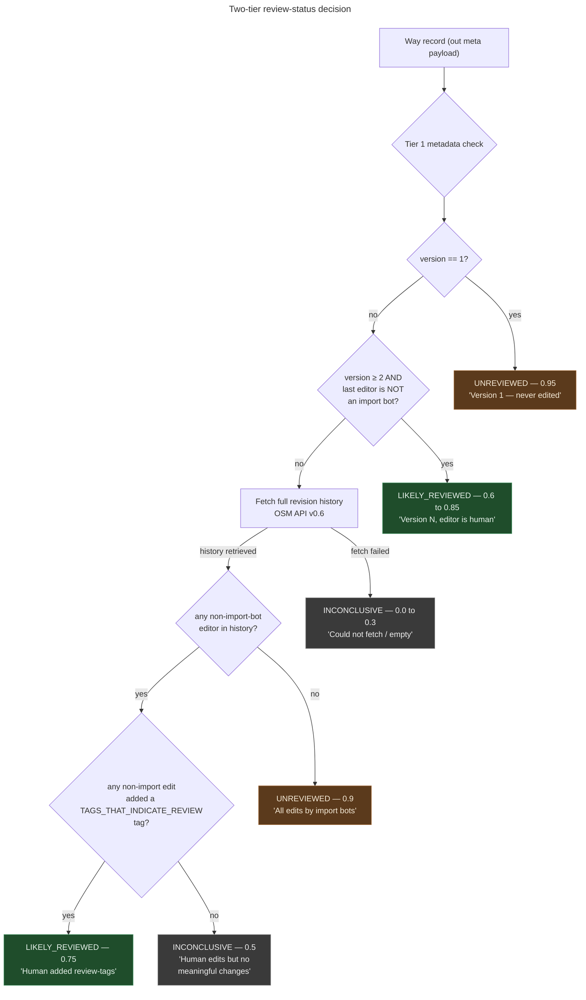

# History filter — has this way been meaningfully reviewed since the TIGER import?

**Summary.** A way carrying `tiger:cfcc` was imported from TIGER in
2007–2008. Whether anyone has *meaningfully reviewed* it since matters
for fix-proposal confidence: a way that's been touched by 5 mappers and
gained `surface` + `maxspeed` + `sidewalk` tags is far less likely to
still carry a TIGER defect than a way nobody has edited since 2008.
The naive answer — read `tiger:reviewed=no` — is **unreliable** because
mappers don't remove the tag even after fully correcting the data.
This module does it the hard way: a two-tier history analysis that
labels each way **UNREVIEWED**, **LIKELY_REVIEWED**, or
**INCONCLUSIVE** with a confidence score, using cheap metadata checks
first and only fetching full revision history when the metadata is
ambiguous.

---

## What this is

The audit pipeline finds candidate defects in TIGER-origin ways. Some
candidates are real defects; others have been silently fixed by humans
since the import without the `tiger:reviewed` tag being updated. To
distinguish them, the pipeline asks: "between the import version and
now, has this way been *meaningfully* edited?"

"Meaningful" is the load-bearing word. It means more than a bot pass
that re-runs cleanup. It means a human looked at the way and made a
non-trivial decision about it. Practical proxies:

- The way is on version ≥ 2 and the last editor is not an import bot.
- Across the version history, at least one non-bot user added a tag
  that requires real-world inspection (`surface`, `lanes`, `maxspeed`,
  `sidewalk`, `cycleway`, `lit`, `turn:lanes*`, etc.).
- The geometry has changed in a way that's not just a TIGER-cleanup
  pattern.

If any of these is true → `LIKELY_REVIEWED`. If none → `UNREVIEWED`.
If the data isn't available to decide → `INCONCLUSIVE` (treat as
`UNREVIEWED` for safety).

The module addresses
[Minh Nguyễn's feedback](https://wiki.openstreetmap.org/wiki/User:Mxn)
that `tiger:reviewed=no` is unreliable — most mappers don't remove the
tag even after fully correcting the data
([history_filter.py:1-6](../../src/osm/history_filter.py#L1-L6)).

## How it works

The analysis is two-tiered to keep the network cost low. Tier 1 is a
metadata check using fields already in the Overpass `out meta` payload;
Tier 2 fetches the full revision history from the OSM API only when
Tier 1 can't decide.

1. **Tier 1 — version + last-editor check.** From the `out meta`
   payload each way carries `version`, `user`, `uid`, `timestamp`,
   `changeset`. Two cases close immediately
   ([history_filter.py:67-90](../../src/osm/history_filter.py#L67-L90)):
   - `version == 1`: never edited since the TIGER import →
     `UNREVIEWED` at 0.95 confidence.
   - `version ≥ 2` *and* last editor is not an import bot →
     `LIKELY_REVIEWED` at 0.6–0.85 confidence (more versions = higher
     confidence, capped at 0.85).
2. **If Tier 1 returned None, fetch history.** The way has multiple
   versions but the last editor *is* an import bot, or some other
   ambiguous shape. Pull the full revision history via OSM API
   ([history.py](../../src/osm/history.py)).
3. **Tier 2 — meaningful-change analysis.**
   `_tier2_analyse()`
   ([history_filter.py:93-150](../../src/osm/history_filter.py#L93-L150))
   inspects every version:
   - If *no* version has a non-import-bot editor → all edits are bots
     → `UNREVIEWED` at 0.9 confidence.
   - Otherwise, check whether any non-import edit introduced one of
     the `TAGS_THAT_INDICATE_REVIEW` (22 tags including `surface`,
     `maxspeed`, `sidewalk`, `cycleway`, `lit`, etc.
     [history_filter.py:32-55](../../src/osm/history_filter.py#L32-L55)).
     If yes → `LIKELY_REVIEWED` at 0.75. If no → `INCONCLUSIVE` at 0.5.
4. **Identify import users robustly.** Three layers
   ([history_filter.py:58-64](../../src/osm/history_filter.py#L58-L64)):
   exact match against `KNOWN_IMPORT_USERS` (TIGER-era usernames +
   known cleanup-bot accounts), prefix match against
   `KNOWN_BOT_PREFIXES` (`josm`, `bot-`, `import`, `fix`, `cleanup`),
   and finally case-insensitive comparison.
5. **Return a result dict.** Every analysis returns
   `{review_status, review_confidence, review_reason}`. The reason
   string is human-readable (e.g.,
   `"Version 5, last editor 'mapper42' is not an import bot"`) and is
   surfaced in the UI so a reviewer can sanity-check the call.

## The flow, visually

*What this shows: the cheap path (Tier 1) closes the two most common
cases — `version == 1` (vast majority of TIGER residuals) and
`version ≥ 2 with human last editor` (clear signal). Only the rare
"version ≥ 2 but last editor is a bot" case reaches Tier 2 and
incurs a network call. What this hides: the geometry-change check
inside `_check_meaningful_changes()`, the rate-limiting and cache
layers in `osm.history`, and the batch-fetch path used by
`filter_by_history()` to amortize history fetches across many ways.*

## Why two-tiered

A scan covers thousands of ways per zone. Fetching the full revision
history for each requires a separate OSM API call (one per way). At
~1 second per call, a 5,000-way scan would take ~80 minutes just for
history fetches.

Tier 1 closes the easy cases without any network call. In practice it
handles the large majority of TIGER ways: most are `version == 1`
(never touched since import), and many of the rest have a clear human
last editor. Only the genuinely-ambiguous ways — `version ≥ 2` with
a bot as last editor — need full history.

The 0.6–0.85 confidence sliding scale at Tier 1
([history_filter.py:83](../../src/osm/history_filter.py#L83):
`min(0.6 + (version - 2) * 0.05, 0.85)`) reflects an empirical
observation: a way at `version == 2` could just be a bot pass after
the import; a way at `version == 7` has been touched repeatedly,
which is itself evidence of human attention.

## Edge cases and gotchas

- **`tiger:reviewed=no` is *not* trusted.** The reason this module
  exists. The tag's removal is voluntary and most mappers leave it
  in place even after fully correcting the data. Don't add a
  shortcut path that reads it.
- **Bot-prefix matching is case-insensitive and prefix-only.**
  `josm-` and `JOSM_` both match. Beyond that, `bot-`, `import`,
  `fix`, and `cleanup` are the recognized prefixes
  ([history_filter.py:30](../../src/osm/history_filter.py#L30)).
  Adding new bot prefixes here is the right move when a new cleanup
  bot starts touching MetroNow zones.
- **`KNOWN_IMPORT_USERS` is curated.** It includes `TIGER_IMPORT_USERS`
  from `config.py` plus five additional usernames identified in the
  Cincinnati-area TIGER cleanup history. Do not add usernames here
  speculatively — false positives in this list label real human
  edits as bot edits, which lets real defects through.
- **`TAGS_THAT_INDICATE_REVIEW` is 22 tags.** Adding a tag here lowers
  the bar for `LIKELY_REVIEWED`. Removing one raises the bar. Both
  shift the review-status distribution; baseline-diff (per
  `docs/explainers/conflation-matcher.md`) catches the operational
  effect.
- **`INCONCLUSIVE` is treated as `UNREVIEWED` downstream.**
  `filter_by_history()` defaults the review status to UNREVIEWED on
  any inconclusive result
  ([history_filter.py:256](../../src/osm/history_filter.py#L256)).
  This is a safety lean — better to surface a way for review than
  to let an inconclusive case escape detection.
- **Empty history responses count as INCONCLUSIVE, not UNREVIEWED.**
  An empty response usually means OSM API rate-limited the request,
  not that the way has no history. Returning UNREVIEWED on a network
  failure would inflate UNREVIEWED counts by API flakiness.
- **`out meta` is required.** This module assumes every way record
  includes `version`, `user`, `uid`. The Overpass query in
  `osm.fetch.overpass_query` uses `out meta geom` for exactly this
  reason — see `docs/explainers/zone-data-flow.md`.
- **The 7-day history cache is at `~/.config/osm/history_cache/`.**
  Per `CLAUDE.md`. Subsequent re-runs of the same scan don't re-fetch.

## Code references

- [`src/osm/history_filter.py:1-6`](../../src/osm/history_filter.py#L1-L6) —
  module docstring; explains why `tiger:reviewed=no` isn't trusted.
- [`src/osm/history_filter.py:16-19`](../../src/osm/history_filter.py#L16-L19) —
  `ReviewStatus` enum (UNREVIEWED / LIKELY_REVIEWED / INCONCLUSIVE).
- [`src/osm/history_filter.py:22-30`](../../src/osm/history_filter.py#L22-L30) —
  `KNOWN_IMPORT_USERS` set + `KNOWN_BOT_PREFIXES` tuple.
- [`src/osm/history_filter.py:32-55`](../../src/osm/history_filter.py#L32-L55) —
  `TAGS_THAT_INDICATE_REVIEW` (22 tags).
- [`src/osm/history_filter.py:58-64`](../../src/osm/history_filter.py#L58-L64) —
  `_is_import_user()` three-layer matcher.
- [`src/osm/history_filter.py:67-90`](../../src/osm/history_filter.py#L67-L90) —
  `_tier1_check()` fast metadata path.
- [`src/osm/history_filter.py:93-150`](../../src/osm/history_filter.py#L93-L150) —
  `_tier2_analyse()` full-history path.
- [`src/osm/history_filter.py:153`](../../src/osm/history_filter.py#L153) —
  `analyse_way_history()` public entry.
- [`src/osm/history_filter.py:184`](../../src/osm/history_filter.py#L184) —
  `_check_meaningful_changes()`: the per-version-pair tag-and-geometry
  inspector that decides "did anything material change?"
- [`src/osm/history_filter.py:239`](../../src/osm/history_filter.py#L239) —
  `filter_by_history()` batch entry; consumes `history.batch_fetch_way_histories`.
- [`src/osm/history.py`](../../src/osm/history.py) — the OSM API v0.6
  history-fetch layer (rate limit + cache).

## See also

- [`CLAUDE.md` § Layout / Pipeline](../../CLAUDE.md) — `history.py`
  and `history_filter.py` are listed as part of the pipeline.
- [`docs/explainers/zone-data-flow.md`](zone-data-flow.md) — explains
  why `out meta geom` is the Overpass mode used (so Tier 1 has the
  fields it needs).
- [`docs/explainers/detector-taxonomy.md`](detector-taxonomy.md) —
  review status feeds the classifier track only; detector-track
  findings don't gate on review status.
- `.claude/skills/tiger-history-deep` — the deep-history skill that
  invokes this module for individual way investigations.
- [Minh Nguyễn's User:Mxn page](https://wiki.openstreetmap.org/wiki/User:Mxn) —
  the local-OSM contact whose feedback this module addresses.
