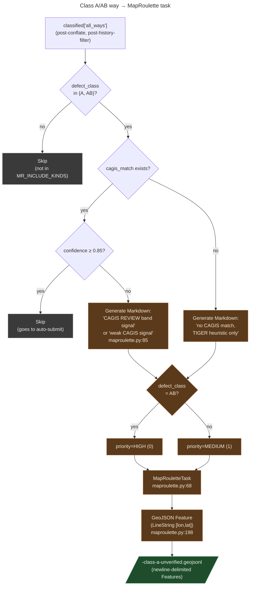

# MapRoulette tasks: escalation path for Class A/AB ways without auto-submit confidence

**Summary.** Some Class A/AB ways have a probable false `oneway=yes`/`-1`
tag (TIGER-fixup heuristic) but the CAGIS conflation either couldn't
match a centerline or matched only at REVIEW confidence (below 0.85).
The mechanical-fix pipeline correctly refuses to auto-submit them.
**MapRoulette** is the right escalation path: a community-review tool
where mappers see one way at a time with a generated Markdown
instruction explaining the suspicion, the CAGIS evidence (if any), and
a link to the way on osm.org. The maintainer doesn't decide whether
each way is a real defect; the community does. Output is GeoJSON Lines
ready for upload via the MapRoulette web UI or `mr-cli`.

---

## What this is

[MapRoulette](https://maproulette.org) is an OSM-community
crowdsourcing platform. A *challenge* is a set of *tasks*; each task
shows a mapper one geographic feature plus a Markdown instruction
explaining what to look at. Mappers complete tasks one at a time,
either fixing the issue in their preferred OSM editor or marking the
task as "not an issue" / "too hard."

For MetroNow, every task is a single OSM way that the audit pipeline
suspects has a false `oneway` tag, but where the evidence is below the
auto-submit threshold. The instruction shows:

- The way's OSM ID, name, and current `oneway` value
- The CAGIS confidence (if any match exists) and what CAGIS says about
  oneway-ness
- A direct OSM-link so the mapper can open the way in their editor
- An attribution line linking to the project wiki page

The challenge file is one `.geojson` per zone, ready for upload via
either the MapRoulette web UI or the `mr-cli` cooperative-challenge
flow ([maproulette.py:27-30](../../src/osm/maproulette.py#L27-L30)).

## How it works

The module produces one challenge per zone in five steps:

1. **Filter classified ways.** `unverified_class_a_ways(classified)`
   ([maproulette.py:153-176](../../src/osm/maproulette.py#L153-L176))
   walks `classified["all_ways"]` and keeps those where:
   - `defect_class` is `A` or `AB` (`MR_INCLUDE_KINDS`
     [maproulette.py:65](../../src/osm/maproulette.py#L65)); AND
   - either `cagis_match` is `None`, or
     `cagis_match.confidence < HIGH_CONFIDENCE (0.85)`; AND
   - the way has a non-empty geometry.

   The HIGH-confidence skip is the load-bearing etiquette: those ways
   go through the mechanical-fix pipeline and don't need community
   review. Sending them to MapRoulette would duplicate the
   maintainer's auto-submitted edits and waste community attention.
2. **Generate the Markdown instruction.** `_instruction_for(way)`
   ([maproulette.py:85-140](../../src/osm/maproulette.py#L85-L140))
   produces a per-task Markdown blob with three branches:
   - CAGIS confidence ≥ REVIEW_CONFIDENCE (0.6) → tells the mapper
     the CAGIS centerline ID and what CAGIS says about oneway,
     framed as "if you confirm…"
   - CAGIS confidence < 0.6 → flags the match as a weak signal;
     instructs the mapper to use editor imagery and local knowledge
   - No CAGIS match within `FALLBACK_BUFFER_M (100m)` → flags the
     task as based purely on the TIGER-fixup heuristic
3. **Assign priority.** `_priority_for(way)`
   ([maproulette.py:143-150](../../src/osm/maproulette.py#L143-L150))
   returns `PRIORITY_HIGH (0)` for Class AB (compound defects),
   `PRIORITY_MEDIUM (1)` for plain Class A, `PRIORITY_LOW (2)`
   otherwise. MapRoulette surfaces lower numbers first; AB candidates
   get reviewed before plain A.
4. **Build the task records.** `build_tasks(ways)`
   ([maproulette.py:179-195](../../src/osm/maproulette.py#L179-L195))
   projects each way into a `MapRouletteTask` dataclass with `way_id`,
   `name`, `defect_class`, `geometry_latlon`, `cagis_match`,
   `instruction`, `priority`.
5. **Serialize as GeoJSON Lines.** `task_to_feature(task)`
   ([maproulette.py:198](../../src/osm/maproulette.py#L198)) converts
   each task into a GeoJSON `Feature` with a `LineString` geometry:
   converting the in-pipeline `[lat, lon]` to GeoJSON's `[lon, lat]`
   order. The output file is one `.geojson` line per task (newline-
   delimited), per the MapRoulette ingestion format
   ([maproulette.py:17-18](../../src/osm/maproulette.py#L17-L18)).

## The flow, visually

*What this shows: every Class A/AB way that did NOT clear the
auto-submit threshold becomes a MapRoulette task. Two skip paths
prevent duplicate work: non-A/AB classes don't go to MapRoulette at
all (they're for different review channels), and HIGH-confidence
matches go to auto-submit instead. What this hides: the per-zone
file naming pattern, the optional `mr-cli` cooperative-challenge
upload flow, and the Markdown's exact phrasing.*

## Why MapRoulette, not direct human review

The maintainer could review every Class A/AB candidate themselves.
Three reasons not to:

- **Volume.** Across the four MetroNow zones, the unverified Class
  A/AB pool is in the high-hundreds. A solo maintainer reviewing
  each one would be the bottleneck on the entire project.
- **Locality.** Local mappers know their streets. A mapper who
  drives Reading Pike daily knows whether `oneway=yes` is correct
  there; the maintainer doesn't.
- **Auditability.** Every MapRoulette task has a public history:
  who completed it, what they marked, and any comments. That history
  is part of the project's defense if a future revert dispute
  arises ("we did surface this for community review").

The 5% false-positive threshold mentioned in `CLAUDE.md` is the
trigger. When a defect class's expected false-positive rate exceeds
5%, MapRoulette is required by project policy. Class A/AB without
HIGH-confidence CAGIS evidence sits in that band by construction:
the absence of a high-confidence match *is* the uncertainty signal.

## Edge cases and gotchas

- **The challenge name uses the wiki URL.** The instruction footer
  cites `https://wiki.openstreetmap.org/wiki/Hamilton_County_TIGER_Audit`
  ([maproulette.py:138](../../src/osm/maproulette.py#L138)). When the
  real wiki page lands at a different URL, this needs updating:
  same reason `WIKI_URL` in `config.py` needs updating before first
  changeset (see `docs/explainers/preflight-checks.md`).
- **GeoJSON requires `[lon, lat]`, the pipeline uses `[lat, lon]`.**
  `task_to_feature()`
  ([maproulette.py:204](../../src/osm/maproulette.py#L204)) does the
  swap. Don't add a second swap upstream: the pipeline format is
  `[lat, lon]` everywhere internally because that matches Overpass
  output.
- **`unverified_class_a_ways` skips ways with empty geometry.** A
  way with no `geometry` field can't be a MapRoulette task (no
  `LineString` to render). These are exceedingly rare; the skip is
  defensive.
- **Class B / Class C / detector-track findings don't go to
  MapRoulette via this module.** Class B (multi-segment shared name
  with disconnect risk) needs a topology-aware task type, not a
  per-way task. Detector-track findings (`oneway_minus_one`, etc.)
  go to a different review surface (the Atlas UI's "Rider-impact
  findings" panel; see `docs/explainers/detector-taxonomy.md`).
- **Priority is integer, lower is higher-surface.** MapRoulette
  convention. Don't flip the polarity.
- **The output file is GeoJSON *Lines*, not GeoJSON.** The MapRoulette
  ingestion format expects newline-delimited Features rather than a
  `FeatureCollection` wrapper. Don't wrap.
- **Each task carries the original `cagis_match` dict if any.**
  ([maproulette.py:216-217](../../src/osm/maproulette.py#L216-L217))
  The mapper can see the same fields the auto-submit logic would
  use, including the rejected confidence value, and form their own
  judgment.

## Code references

- [`src/osm/maproulette.py:1-40`](../../src/osm/maproulette.py#L1-L40)
 : module docstring (Phase 3 framing, output format, etiquette).
- [`src/osm/maproulette.py:57-59`](../../src/osm/maproulette.py#L57-L59)
 : `PRIORITY_HIGH / MEDIUM / LOW` constants.
- [`src/osm/maproulette.py:65`](../../src/osm/maproulette.py#L65):
  `MR_INCLUDE_KINDS = frozenset({CLASS_A, CLASS_AB})`.
- [`src/osm/maproulette.py:68-78`](../../src/osm/maproulette.py#L68-L78)
 : `MapRouletteTask` dataclass.
- [`src/osm/maproulette.py:85-140`](../../src/osm/maproulette.py#L85-L140)
 : `_instruction_for()` Markdown generator with three CAGIS branches.
- [`src/osm/maproulette.py:143-150`](../../src/osm/maproulette.py#L143-L150)
 : `_priority_for()` AB > A > other.
- [`src/osm/maproulette.py:153-176`](../../src/osm/maproulette.py#L153-L176)
 : `unverified_class_a_ways()` filter.
- [`src/osm/maproulette.py:179-195`](../../src/osm/maproulette.py#L179-L195)
 : `build_tasks()` projection.
- [`src/osm/maproulette.py:198`](../../src/osm/maproulette.py#L198):
  `task_to_feature()` GeoJSON serialization.
- [`web/server.js`](../../web/server.js): the
  `/api/maproulette/:zone/class-a` endpoint that writes the per-zone
  GeoJSON Lines file using `zonePath()` containment.

## See also

- [`CLAUDE.md` § OSM community requirements](../../CLAUDE.md):
  references MapRoulette as the channel for findings with > 5%
  expected false-positive rate.
- [`docs/explainers/detector-taxonomy.md`](detector-taxonomy.md):
  the dual-track classifier vs detector design; MapRoulette is for
  the classifier track's unverified candidates.
- [`docs/explainers/conflation-matcher.md`](conflation-matcher.md):
  why `cagis_match.confidence` < HIGH is the trigger for MapRoulette.
- [`docs/explainers/zone-data-flow.md`](zone-data-flow.md): the
  zone polygon clip that the etiquette policy references (only ways
  inside the zone go to MapRoulette).
- [MapRoulette docs](https://learn.maproulette.org/): challenge /
  task / cooperative-challenge formats.
- `.claude/skills/maproulette-challenge`: the project skill that
  invokes this module to produce a challenge per scan.
