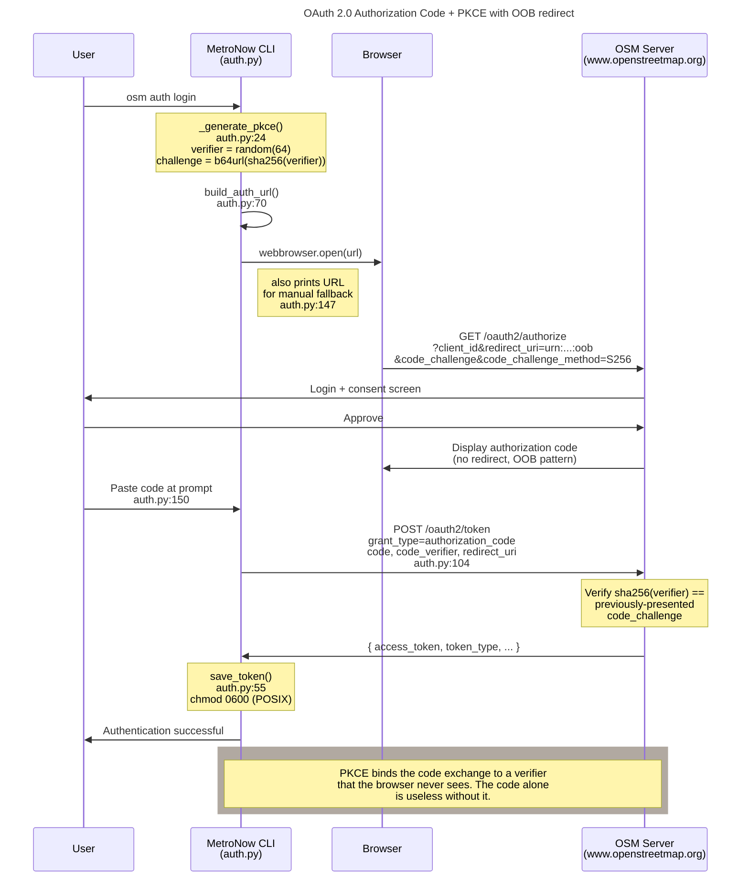

# OAuth 2.0 + PKCE flow: how the `_cincyimport` account authenticates to OSM

**Summary.** Submitting changesets to OpenStreetMap requires an OAuth
2.0 access token. The MetroNow client uses the **Authorization Code
flow with PKCE (RFC 7636)** and an **out-of-band (OOB) redirect URI**
(`urn:ietf:wg:oauth:2.0:oob`): the user authorizes in a browser, OSM
displays a code, the user pastes it into the CLI, the client
exchanges code+verifier for a token. PKCE is the actual security
mechanism (binds the code exchange to a secret never sent to the
browser); the `state` parameter is constructed for protocol
completeness but unenforced because OOB has no callback to validate
against. Tokens land at `~/.config/osm/token.json` with `0600`
permissions on POSIX.

---

## What this is

OAuth 2.0 is a delegation protocol: the user grants the MetroNow CLI
permission to act on OSM on their behalf, without giving the CLI
their password. The "Authorization Code flow" is the standard OAuth
sub-flow for confidential clients; the "+ PKCE" extension (Proof Key
for Code Exchange, RFC 7636) makes it safe for clients that can't
keep a `client_secret` truly secret: including CLI tools where the
secret would have to ship in source.

The **OOB redirect URI** (`urn:ietf:wg:oauth:2.0:oob`) is an OAuth
convention for clients without a webserver to receive the redirect.
OSM displays the authorization code on a confirmation page, the user
copies it, and the CLI prompts for the paste. There is no automated
callback.

Why this combination:

- **Authorization Code (not implicit, not password)**: implicit flow
  was deprecated by OAuth 2.1; password flow requires the user's
  OSM password to touch the CLI, which is the thing OAuth exists to
  avoid.
- **PKCE (not client_secret alone)**: a CLI's `client_secret` is not
  actually secret: anyone with the source can read it. PKCE replaces
  the secret with a per-flow verifier generated client-side and
  discarded after exchange. OSM accepts both PKCE and `client_secret`
  in parallel; we send both, and PKCE is the one doing real work.
- **OOB (not a localhost callback)**: avoids running a temporary HTTP
  server on a free port, which would pull in additional surface area
  (port allocation, firewall prompts on macOS, Windows Defender) for
  no security benefit on a single-maintainer tool.

## How it works

The flow has six steps. Steps 1-4 happen in
[`auth.py:build_auth_url()`](../../src/osm/auth.py#L70) and the
interactive
[`login()`](../../src/osm/auth.py#L130) wrapper; steps 5-6 happen in
[`exchange_code()`](../../src/osm/auth.py#L104).

1. **Generate the PKCE verifier and challenge.** `_generate_pkce()`
   ([auth.py:24-28](../../src/osm/auth.py#L24-L28)) creates a
   64-character URL-safe random `verifier`, then computes
   `challenge = base64url(sha256(verifier))`. The verifier stays in
   the Python process; only the challenge goes in the URL.
2. **Build the authorization URL.** Compose the OSM authorization
   endpoint with `client_id`, `redirect_uri =
   urn:ietf:wg:oauth:2.0:oob`, `response_type = code`,
   `scope = "write_api read_prefs"`, `state` (32-byte random),
   `code_challenge`, and `code_challenge_method = S256`
   ([auth.py:92-101](../../src/osm/auth.py#L92-L101)).
3. **Open the browser for user consent.** `login()`
   ([auth.py:130-156](../../src/osm/auth.py#L130-L156)) calls
   `webbrowser.open(url)` and *also* prints the URL to stdout: the
   print is required so that the user can fall back to manual paste
   when the browser doesn't auto-launch (headless servers, broken
   `BROWSER` env, WSL).
4. **User authorizes; OSM displays the code.** OSM redirects to the
   OOB URI by displaying the authorization code on its own
   confirmation page (because no real redirect is possible with the
   OOB target). The user copies the code from the page and pastes it
   at the CLI prompt.
5. **Exchange code+verifier for a token.** `exchange_code()`
   ([auth.py:104-127](../../src/osm/auth.py#L104-L127)) POSTs to the
   OSM token endpoint with `grant_type=authorization_code`,
   `client_id`, `code`, `redirect_uri`, and `code_verifier`. OSM
   verifies that `sha256(verifier)` equals the previously-presented
   `code_challenge` and issues an access token.
6. **Save the token to disk with `0600` perms.** `save_token()`
   ([auth.py:55-60](../../src/osm/auth.py#L55-L60)) writes the JSON to
   `TOKEN_PATH` (`~/.config/osm/token.json`) and applies `chmod 0600`
   on POSIX. Subsequent calls use `get_access_token()`
   ([auth.py:63-67](../../src/osm/auth.py#L63-L67)) to read the
   bearer token from disk.

## The flow, visually

*What this shows: the PKCE verifier never traverses the browser. It
goes directly from the CLI's first call (where it's hashed into the
challenge) to the CLI's second call (where it's sent in clear to the
token endpoint). An attacker who steals the auth code (e.g., from
the OSM confirmation page over the user's shoulder) cannot exchange
it without the verifier. What this hides: token refresh (OSM doesn't
expire tokens automatically; refresh is manual via
`osm auth login`), the `client_secret` we also send (legacy belt +
suspenders; PKCE alone is sufficient), and the credentials.json
file format.*

## Why PKCE: and why `state` is unenforced

The `state` parameter exists to prevent CSRF on redirect-based OAuth
flows: the client generates a random `state`, the authorization
server echoes it on redirect, and the client verifies they match. If
they don't, the response was injected by an attacker.

This client uses OOB. There is no redirect for the server to inspect,
nothing to compare `state` against. The
[build_auth_url() docstring](../../src/osm/auth.py#L70-L87) is explicit
about this: `state` is generated for protocol completeness, not
enforcement.

The CSRF role is filled instead by **PKCE**. The verifier is
generated client-side, never sent to the browser, and required to
exchange the code for a token. An attacker who intercepts the code
(through a browser-history theft, a malicious browser extension,
shoulder-surfing the OSM display) cannot redeem it without also
having intercepted the Python process's memory.

A future migration to a localhost callback redirect URI would let
the server validate `state` properly and add belt-and-suspenders
protection. Until then, PKCE is sufficient: and it's already what
RFC 7636 is for.

## Edge cases and gotchas

- **CodeQL alert #3 is filtered out at `auth.py:147`.** The print of
  the auth URL gets flagged as `py/clear-text-logging-sensitive-data`
  by name-based heuristics on `OAUTH_REDIRECT_URI`. Per RFC 6749
  §4.1.1, the URL contains only public values: `client_id`,
  `redirect_uri` (the OOB URN), `response_type`, `scope`,
  `code_challenge` (a one-way hash, not the secret), and `state`.
  The PKCE verifier never goes in the URL. The alert is filtered via
  `.github/codeql/codeql-config.yml`.
- **`credentials.json` must exist and contain `client_id`.**
  `load_credentials()` raises `FileNotFoundError` with a paste-ready
  template message
  ([auth.py:31-42](../../src/osm/auth.py#L31-L42)). The error
  message itself shows the expected JSON shape so a fresh setup
  doesn't have to grep for it.
- **`client_secret` is optional.** If `credentials.json` includes
  `client_secret`, it gets sent at code-exchange time. If not, PKCE
  alone authenticates the code exchange. Both modes work with OSM.
- **Token files are world-unreadable on POSIX.** `chmod 0600`
  ([auth.py:60](../../src/osm/auth.py#L60)) restricts the token file
  to the owner. Windows has no equivalent in the `os` module here, so
  the file permissions follow `umask`. Don't run the CLI on a
  multi-user Windows account where another user can read your home
  directory.
- **`save_token()` overwrites without backup.** A fresh `osm auth
  login` discards the prior token. Refresh tokens (if OSM ever
  starts issuing them) would also live in this file; today the file
  contains only `{ access_token, token_type, scope, created_at }`.
- **`TOKEN_PATH` is per-user.** It's at `~/.config/osm/token.json`
  per `config.py`. There is no project-level fallback. A scan in a
  clone of the repo on a fresh machine requires `osm auth login`
  first.
- **The OAuth scope `write_api read_prefs` is what changeset
  submission needs.** `write_api` is the load-bearing scope:
  removing it makes the token submission-incapable. `read_prefs` is
  used by `osm auth status` to display the authenticated username.
  Don't widen the scope; don't narrow it.

## Code references

- [`src/osm/auth.py:1`](../../src/osm/auth.py#L1): module
  one-liner: "OAuth 2.0 Authorization Code + PKCE flow for
  OpenStreetMap API (OOB redirect)."
- [`src/osm/auth.py:24-28`](../../src/osm/auth.py#L24-L28):
  `_generate_pkce()`: verifier = `secrets.token_urlsafe(64)`,
  challenge = `base64url(sha256(verifier))`.
- [`src/osm/auth.py:31-42`](../../src/osm/auth.py#L31-L42):
  `load_credentials()`: reads `credentials.json`, validates
  `client_id` is present, raises with paste-ready template on
  missing-file.
- [`src/osm/auth.py:55-60`](../../src/osm/auth.py#L55-L60):
  `save_token()`: writes JSON, chmod 0600 on POSIX.
- [`src/osm/auth.py:70-101`](../../src/osm/auth.py#L70-L101):
  `build_auth_url()`: composes OAuth URL with all PKCE params; the
  docstring explains why `state` is unenforced.
- [`src/osm/auth.py:104-127`](../../src/osm/auth.py#L104-L127):
  `exchange_code()`: POSTs to token endpoint, calls `save_token()`.
- [`src/osm/auth.py:130-156`](../../src/osm/auth.py#L130-L156):
  `login()`: interactive CLI flow with `webbrowser.open()` plus
  manual-paste fallback.
- [`src/osm/config.py`](../../src/osm/config.py): `CREDENTIALS_PATH`,
  `TOKEN_PATH`, `OAUTH_REDIRECT_URI` (the OOB URN), `OSM_AUTH_URL`,
  `OSM_TOKEN_URL`.
- `.github/codeql/codeql-config.yml`: the suppression for alert #3
  (false-positive `py/clear-text-logging-sensitive-data` at
  auth.py:147).

## See also

- [`CLAUDE.md` § Paths](../../CLAUDE.md): `OAuth: OOB redirect
  (urn:ietf:wg:oauth:2.0:oob), credentials at
  ~/.config/osm/credentials.json, token at ~/.config/osm/token.json`.
- [`docs/explainers/osm-community-gating.md`](osm-community-gating.md):
  why the `_cincyimport` account exists and what scope it needs.
- [`docs/explainers/phase-status.md`](phase-status.md): the OAuth
  token requirement is part of the Phase 1 pre-flight checklist.
- [RFC 7636: PKCE](https://datatracker.ietf.org/doc/html/rfc7636):
  the PKCE specification.
- [RFC 6749: OAuth 2.0](https://datatracker.ietf.org/doc/html/rfc6749):
  authorization code flow + OOB redirect convention.
- [OSM OAuth 2.0 docs](https://wiki.openstreetmap.org/wiki/OAuth):
  OSM-specific endpoint information.
