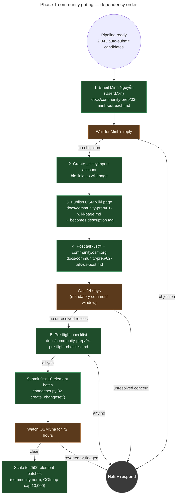

# OSM community gating — why mechanical edits need permission first

**Summary.** A *mechanical edit* on OpenStreetMap is a batch change that
applies the same rule across many features without per-element human
judgment. OSM treats mechanical edits very differently from regular
mapping: they require a published wiki page, a public mailing-list
discussion with a 14-day comment window, an account with the
`_cincyimport` suffix convention, and a specific set of changeset tags.
Skipping any one of these is the canonical shape of an edit that gets
reverted and the account banned. This explainer walks the four required
steps in dependency order, explains what happens if you skip each one,
and points at the artifacts and code that implement them.

---

## What this is

A **mechanical edit** is *not* defined by tooling — you can do mechanical
edits in iD or JOSM, just slowly. It is defined by *behavior*: applying
the same rule across many features without inspecting each one. The
canonical examples:

- "Set `maxspeed=25 mph` on every residential street that doesn't have one"
  — yes, mechanical.
- "Fix the typo on Reading Road" — no, regular editing.
- "Reclassify every Hamilton County `highway=residential` whose CAGIS
  centerline is `Functional_Class=Arterial`" — yes, mechanical, even if
  done one at a time.

OSM's [Automated Edits Code of Conduct](https://wiki.openstreetmap.org/wiki/Automated_Edits_code_of_conduct)
governs this category. The CoC is short and absolute: documentation
*before* the edit, discussion *before* the edit, attribution *on* the
edit. The Data Working Group (DWG) reverts non-compliant edits and
suspends accounts that don't comply.

The reason the CoC is so strict is that OSM is a single shared database
with millions of mappers. A bad mechanical edit that touches 10,000
features destroys 10,000 mappers' work. A bad mechanical edit that touches
2,043 features (MetroNow's pipeline) is small in OSM terms but still
big enough that the CoC applies in full.

The four required artifacts that gate Phase 1 are drafted in
`docs/community-prep/01-04.md`. This explainer describes the *order*
they go in and *why*.

## How it works

The gating runs in five steps. Each step depends on the previous one
completing — skipping or reordering breaks the next step.

1. **Private outreach to the local OSM contact.** Email or OSM-message
   Minh Nguyễn ([User:Mxn](https://wiki.openstreetmap.org/wiki/User:Mxn))
   first. He is the de-facto reviewer for organised edits in the
   Cincinnati area. A private "looks fine, post it" from him substantially
   de-risks the public posts; an objection caught privately means the
   public post can incorporate the objection's answer rather than have
   to address it live. Draft: `docs/community-prep/03-minh-outreach.md`.
2. **Create the `_cincyimport`-convention OSM account.** OSM convention
   for organised edits is to use a dedicated account whose username ends
   in a recognized suffix. The `_cincyimport` suffix has precedent
   locally (the Hamilton County Building Import). The account's bio
   must link to the wiki page (step 3). The convention exists so OSMCha
   reviewers and DWG can recognize at a glance that an edit is an
   organised edit subject to the CoC, rather than a regular mapper's
   experiment.
3. **Publish the OSM wiki page.** The page lives at
   `wiki.openstreetmap.org/wiki/Automated_edits/<account-name>` and
   documents what edits the account performs, what evidence it uses
   (CAGIS centerlines, TIGER 2024), what it explicitly does *not* do
   (no detector-track edits — see
   `docs/explainers/detector-taxonomy.md`), and an opt-out contact.
   Draft: `docs/community-prep/01-wiki-page.md`. The published URL
   becomes the value of the `description` tag on every changeset
   ([changeset.py:107](../../src/osm/changeset.py#L107)) and must
   match `src/osm/config.py:WIKI_URL`
   ([config.py:69](../../src/osm/config.py#L69)) exactly.
4. **Post to the mailing list and forum.** Email
   `talk-us@openstreetmap.org` and open a topic at
   `community.openstreetmap.org/c/local-chapters/united-states`,
   cross-linked to each other. The post describes the same edits the
   wiki page documents, links to the wiki page, and asks for a 14-day
   comment window. Draft: `docs/community-prep/02-talk-us-post.md`.
   Read every reply. Address concerns or pause the timeline if the
   community asks.
5. **Run the pre-flight checklist on submission day.** Every item in
   `docs/community-prep/04-pre-flight-checklist.md` is a yes/no the
   maintainer can verify the day-of. The checklist re-validates the
   community gates (wiki published? talk-us@ ≥ 14 days ago? Minh
   responded? no unresolved comments?), account hygiene, pipeline
   state, scan freshness, and changeset constraints. If any item is
   No, stop.

After the gates pass, the first changeset goes out — capped at 10
elements, watched on OSMCha for 72 hours, then scaled gradually.

## The flow, visually

*What this shows: every step is a hard prerequisite for the next one.
The two `Wait` nodes are real wall-clock pauses, not optional. Three
edges lead to `Halt` — Minh objection, unresolved community concern, or
any pre-flight No. What this hides: the changeset-tag composition (see
"Changeset tags" below) and the `osm preflight --zone` automated check
that codifies most of step 5.*

## What happens if you skip each step

The four steps are not a checklist of polite gestures — each one closes
a specific failure mode. The clearest way to internalize them is to ask
"what does it cost if I skip this one?"

- **Skip Minh outreach.** A reasonable concern that Minh would have
  caught privately gets raised on `talk-us@` instead. The comment
  window resets while you address it; what was a 14-day delay becomes
  4–6 weeks. Worse: if the concern is correct, your first public post
  starts on the wrong foot, and the project has a credibility cost
  to pay back even after the issue is fixed.
- **Skip the account convention.** OSMCha and DWG reviewers spot a
  burst of edits from a regular-looking account and treat them as a
  rogue mapper rather than an organised edit. The default response is
  fast revert. By the time you explain "this was supposed to be
  organised," the changeset is gone.
- **Skip the wiki page.** The `description` tag on the changeset has
  no URL to point at. The CoC requires a wiki page; without one, the
  edit is non-compliant on its face. DWG reverts on sight.
- **Skip the talk-us@ + community.osm.org post.** The community had no
  notice and no comment window. CoC violation; same outcome as the
  wiki page case, plus reputational cost in the local mapping
  community that's harder to undo than a single revert.
- **Skip the 14-day wait.** Even with all four artifacts published,
  the CoC explicitly requires a comment window. Submitting before
  the window closes is treated as evidence of bad faith — the community
  will assume you knew about the rule and chose to ignore it.

## Changeset tags — what gets emitted

Every changeset opened by `osm.changeset.create_changeset()`
([changeset.py:82](../../src/osm/changeset.py#L82)) carries a fixed set
of tags, regardless of which fix kind is being applied:

| Tag | Source | Purpose |
|---|---|---|
| `comment` | per-batch, passed in | Human-readable summary of the batch |
| `source` | `DEFAULT_SOURCE` | What evidence the fix uses (CAGIS, TIGER, etc.) |
| `created_by` | hardcoded ([changeset.py:101](../../src/osm/changeset.py#L101)) | `MetroNow TIGER Audit Pipeline/0.1` |
| `mechanical=yes` | conditional, default True ([changeset.py:104](../../src/osm/changeset.py#L104)) | Declares this as a mechanical edit per CoC |
| `bot=yes` | conditional, default True ([changeset.py:105](../../src/osm/changeset.py#L105)) | Reinforces the mechanical declaration; flags for OSMCha bot view |
| `description` | `WIKI_URL` ([changeset.py:107](../../src/osm/changeset.py#L107)) | URL of the wiki page that documents the edit |
| `cagis:attribution` | conditional on CAGIS evidence ([changeset.py:108-111](../../src/osm/changeset.py#L108-L111)) | Open Data Hub license attribution; mandatory for any changeset using CAGIS evidence |

The `description` tag's value comes from
[`config.py:WIKI_URL`](../../src/osm/config.py#L69), which currently
ships as a placeholder
(`https://wiki.openstreetmap.org/wiki/Hamilton_County_TIGER_Audit`).
**This must be updated before the first submission** so the value
exactly matches the published wiki page URL — the pre-flight checklist
([04-pre-flight-checklist.md](../community-prep/04-pre-flight-checklist.md))
calls this out explicitly.

`cagis:attribution` is mandatory whenever the changeset includes any
fix backed by CAGIS evidence, per the CAGIS Open Data Hub license. The
attribution string itself lives at
[`conflate.py:76-79`](../../src/osm/conflate.py#L76-L79).

## Edge cases and gotchas

- **CGImap hard limit is 10,000 elements per changeset, but never
  approach it.** The community norm is ~500 elements. Phase 1 starts at
  10 to give OSMCha and the community a small target to react to.
- **The DWG import-role request is *not* in Phase 1.** Default rate limit
  is 1,000 edits/hr, ramping to 100,000 over a week per OSM API policy.
  Phase 1's 10-element + ≤500-element pattern fits comfortably under
  this. The DWG request is a Phase 5 (full-scale) prerequisite —
  noted in [`docs/community-prep/00-README.md`](../community-prep/00-README.md).
- **The wiki page URL is sticky.** Once the first changeset goes out
  with a `description` value, every subsequent batch should use the
  same URL. Renaming the wiki page after launch leaves a trail of
  broken `description` links across previous changesets.
- **`mechanical=yes` and `bot=yes` are both emitted, intentionally.**
  `mechanical=yes` is the CoC term; `bot=yes` is the older OSMCha
  convention that bot-flag filters key off. Emitting both ensures the
  edit is correctly classified by every downstream reviewer tool.
- **Detector-track findings never reach this gating.** Per
  [`docs/explainers/detector-taxonomy.md`](detector-taxonomy.md), only
  the classifier-track outputs (with CAGIS-verified confidence ≥ 0.85)
  flow through `osm.changeset`. The mechanical-edit account never
  submits a fix derived from a rider-impact detector — those go to
  MapRoulette / human review only. This is what allows the CoC
  declaration "we only do <these specific tag changes>" to be
  truthful, which is what allows the account to remain in good standing.
- **The `osm preflight --zone <key>` command codifies most of the
  pre-flight checklist.** It runs 16 checks across 6 categories with
  PASS/FAIL/WARN/MANUAL exit codes. `--strict` escalates WARN to FAIL.
  Some items remain MANUAL because they require human judgment (did
  Minh respond? are there unresolved comments?) — the command can't
  introspect mailboxes.
- **Phase 1 is currently human-action-blocked.** As of 2026-05-08,
  the four `docs/community-prep/01-04.md` drafts are ready but none
  have been published. The Transit-App ToS-compliance email was sent
  (separate workstream); the OSM gating is still pending. See the
  Phase status section of `CLAUDE.md` for the current blocker list.

## Code references

- [`src/osm/changeset.py:82`](../../src/osm/changeset.py#L82) —
  `create_changeset()` entry point.
- [`src/osm/changeset.py:98-111`](../../src/osm/changeset.py#L98-L111) —
  the seven changeset tags emitted (the four mechanical-edit tags plus
  comment / source / created_by).
- [`src/osm/config.py:69`](../../src/osm/config.py#L69) — `WIKI_URL`
  placeholder; must match the published wiki URL before first submission.
- [`src/osm/conflate.py:76-79`](../../src/osm/conflate.py#L76-L79) —
  `CAGIS_ATTRIBUTION` string used as the `cagis:attribution` tag value.
- [`src/osm/preflight.py`](../../src/osm/preflight.py) — `osm preflight
  --zone <key>` runs 16 codified checks across 6 categories.
- [`docs/community-prep/00-README.md`](../community-prep/00-README.md) —
  the maintainer-facing README that orders the four artifacts and
  explains why the order matters.
- [`docs/community-prep/01-wiki-page.md`](../community-prep/01-wiki-page.md) —
  draft wiki page content (paste into `Automated_edits/<account-name>`).
- [`docs/community-prep/02-talk-us-post.md`](../community-prep/02-talk-us-post.md) —
  draft talk-us@ + community.osm.org post.
- [`docs/community-prep/03-minh-outreach.md`](../community-prep/03-minh-outreach.md) —
  draft private outreach to Minh Nguyễn.
- [`docs/community-prep/04-pre-flight-checklist.md`](../community-prep/04-pre-flight-checklist.md) —
  day-of submission checklist.

## See also

- [`CLAUDE.md` § OSM community requirements](../../CLAUDE.md) — the
  dense source statement this explainer decompresses, plus the current
  Phase 1 blocker list.
- [`docs/explainers/detector-taxonomy.md`](detector-taxonomy.md) — why
  only classifier-track outputs reach the changeset queue (the truthful-CoC
  prerequisite).
- [`docs/explainers/conflation-matcher.md`](conflation-matcher.md) — how
  fixes get the ≥ 0.85 confidence required to be CAGIS-verified and
  therefore eligible for `mechanical=yes` submission.
- [OSM Automated Edits Code of Conduct](https://wiki.openstreetmap.org/wiki/Automated_Edits_code_of_conduct) —
  the canonical policy this explainer implements.
- [OSM Import Guidelines](https://wiki.openstreetmap.org/wiki/Import/Guidelines) —
  related policy; mechanical edits and imports overlap heavily, and DWG
  applies similar standards.
- [OSMCha](https://osmcha.org/) — the changeset-review tool used by
  reviewers and the DWG to spot non-compliant edits.
