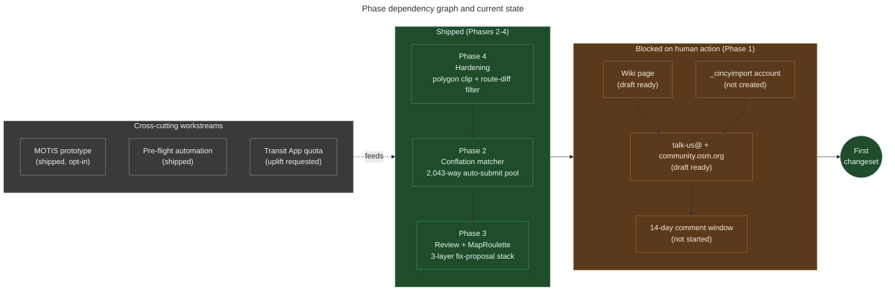

# Phase status: what each phase delivers and what gates it

**Summary.** MetroNow's work is organized into four phases plus a small set
of cross-cutting workstreams. **Phase 1** is community gating (the
talk-us@ / wiki-page / `_cincyimport`-account artifacts that have to land
before *any* mechanical edit submits). **Phase 2** is the conflation
matcher and its diagnostics (CAGIS centerline matching, F1 through F4 baseline
attribution, asymmetric-promotion alerts). **Phase 3** is review tooling
and MapRoulette task generation for findings that exceed the 5%
false-positive threshold. **Phase 4** is hardening: polygon clipping,
route-diff false-positive filtering, detector tuning. Phases 2-4 have all
shipped. Phase 1 is the only blocker on the first changeset. This
explainer walks through what each phase actually delivered, what gates
the transitions, and why "Phase 1 blocked on human action" is the
shape of the current standstill.

---

## What this is

A *phase* in MetroNow is a sequenced workstream with a clear deliverable,
not a calendar period. Phases run sequentially because each unlocks the
next: Phase 2's matcher feeds Phase 3's auto-submit pool, which Phase 4
hardens, which Phase 1 then publishes for community review before the
first submission. The numbering is historical: Phase 2 came first
chronologically (the matcher), but Phase 1 (community gating) is the
last gate before submission and so claims position 1 in the dependency
graph.

The current Phase status header in
[`CLAUDE.md`](../../CLAUDE.md) is the source of truth for "what's done /
what's blocked." This explainer expands each entry into "what the phase
delivers, what gates it, and what artifacts in the codebase represent
its completion."

## How it works

Each phase has three properties: a *deliverable* (a thing that exists in
the codebase or in the world), a *gate* (the thing that has to happen
for the phase to be considered complete), and a *consumer* (which
downstream phase depends on it). When all four phases' gates close,
the project ships its first changeset.

1. **Phase 1: Community gating.** Deliverable: published OSM wiki page
   + `talk-us@`/`community.osm.org` posts + `_cincyimport`-suffix account
   + 14-day comment window. Gate: every step in
   `docs/community-prep/04-pre-flight-checklist.md` says yes. Consumer:
   `osm.changeset.create_changeset()`
   ([changeset.py:82](../../src/osm/changeset.py#L82)). Status:
   **⏳ blocked on human action**. The four numbered drafts under
   `docs/community-prep/` (`01-wiki-page.md`, `02-talk-us-post.md`,
   `03-minh-outreach.md`, `04-pre-flight-checklist.md`) are ready;
   nothing has been published yet. See
   `docs/explainers/osm-community-gating.md` for the dependency order.
2. **Phase 2: Conflation matcher.** Deliverable: `osm.conflate` module
   producing `cagis_match` annotations on every way; CAGIS centerline
   load + STRtree index + directed-Hausdorff scoring + F1 through F4 baseline
   attribution + `osm baseline-diff` asymmetric-promotion alert. Gate:
   2,043-way auto-submit pool stable across runs (no asymmetric
   promotions). Consumer:
   `osm.review.proposed_fixes_for_way`
   ([review.py:112](../../src/osm/review.py#L112)). Status: **✅ shipped**.
   See `docs/explainers/conflation-matcher.md`.
3. **Phase 3: Review and MapRoulette.** Deliverable: per-way fix
   proposals with three-layer evidence stack (heuristic / CAGIS-verified
   / TIGER-verified) and MapRoulette-task generators for findings whose
   expected false-positive rate exceeds 5%. Gate: every fix carrying
   `mechanical=yes` traces to ≥ 0.85 confidence; every other finding
   has a MapRoulette task. Consumer: human reviewer (in MapRoulette) or
   `osm.changeset` (for auto-submittable fixes). Status: **✅ shipped**;
   `osm.maproulette` generates GeoJSON tasks constrained to MetroNow
   zone polygons.
4. **Phase 4: Hardening.** Deliverable: polygon clipping
   ([polygons.py](../../src/osm/polygons.py)), route-diff false-positive
   filtering ([route_diff.py](../../src/osm/route_diff.py)), detector
   tuning. Gate: Forest Park's F1 rate dropped from 78% to a normal
   range after the polygon clip removed Butler County bleed. Consumer:
   classifier (Phase 2 dependency, but Phase 4 came after Phase 2 and
   improved its inputs retroactively). Status: **✅ shipped**.

In addition to the four phases, several cross-cutting workstreams sit
alongside:

- **MOTIS prototype**: opt-in second routing engine alongside BRouter.
  Status: shipped at [`src/osm/motis.py`](../../src/osm/motis.py); engine
  dispatcher in `route_diff.py` is the next-session item. See
  `docs/explainers/routing-engine-dispatch.md`.
- **Pre-flight automation**: `osm preflight --zone <key>` runs 16
  codified checks across 6 categories with PASS/FAIL/WARN/MANUAL exit
  codes ([preflight.py](../../src/osm/preflight.py)). Status: shipped.
- **Transit App quota tooling**: `osm transit-status`,
  `osm transit-budget`, `fcntl.flock`-guarded usage counter
  ([transit.py](../../src/osm/transit.py)). Status: shipped; quota
  uplift email sent, awaiting reply.
- **CodeQL alerts**: security findings from GitHub's static analysis.
  Status: alerts #4, #6-10, #17, #24 fixed; #3 (auth.py:120 OAuth URL
  print) flagged for "won't fix / false positive" UI dismissal.

## The flow, visually

*What this shows: Phases 2, 3, 4 are all done and feed into Phase 1's
gate; Phase 1 is the single remaining block before the first changeset.
The cross-cutting workstreams are independently shipped and don't gate
the first submission. What this hides: the per-zone state of the
auto-submit pool (728 / 637 / 299 / 379 ways across the four zones),
the OSMCha 72-hour watch period after the first submission, and the
DWG import-role request that gates eventual full-scale submission.*

## Why Phase 1 is human-action-blocked

Every other phase delivers code or data that can be tested and merged.
Phase 1 delivers four artifacts that have to be *published* into systems
outside the repo: an OSM wiki page, a public mailing-list post, an
`osm.org` account, and a forum topic. None of these can be done by the
maintainer-as-developer; they require the maintainer-as-civic-actor to
log into OSM, paste the drafts, and start the comment window. The
scripts can't help because the scripts don't have OSM credentials and
shouldn't.

The four numbered drafts under `docs/community-prep/` are paste-ready precisely
to keep this step short: when the maintainer has 30 minutes to do the
publication, the work is "open four browser tabs, paste, save, send."
But until that 30 minutes happens, the entire 2,043-way auto-submit
pool waits.

## Edge cases and gotchas

- **Phases ≠ sprints.** A "phase" here is a deliverable, not a
  time-boxed iteration. Phase 4 took longer than Phase 2 in calendar
  time but is a smaller deliverable; the numbering reflects dependency,
  not duration.
- **Within-phase substages.** Phase 2 has internal "Phase 2a" / "Phase
  2b" labels in code comments (e.g.
  [conflate.py:86-96](../../src/osm/conflate.py#L86-L96) for the Phase 2b
  fallback rationale). These are informal; they document iteration
  inside a phase rather than separate dependency steps.
- **MOTIS is not a Phase.** It's a cross-cutting prototype that
  *augments* Phase 4's route-diff work without gating it. The pipeline
  silently degrades to BRouter-only when MOTIS isn't reachable
  ([motis.py:328-349](../../src/osm/motis.py#L328-L349) `is_available()`
  probe).
- **Pre-flight automation is partial.** The `osm preflight` command
  codifies ~30 of the items in `docs/community-prep/04-pre-flight-checklist.md`,
  but several remain MANUAL (did Minh respond? are there unresolved
  comments?) because they require human attestation
  ([preflight.py:1-7](../../src/osm/preflight.py#L1-L7)).
- **The dates in the CLAUDE.md Phase status header drift.** The header
  reads "as of 2026-05-08 EOD, commit `9836bb9`": these are pinned at
  the last update of that section, not the current commit. When phases
  change state, update the timestamp explicitly.
- **CodeQL #3 is the only unresolved security alert.** Per RFC 6749 §4.1.1
  the OAuth URL printed at `auth.py:120` contains no actual secrets, so
  the alert is a false positive. The fix is a UI dismissal, not a code
  change.

## Code references

- [`CLAUDE.md`](../../CLAUDE.md) § Phase status: the source-of-truth
  status header.
- [`src/osm/changeset.py:82`](../../src/osm/changeset.py#L82):
  `create_changeset()`, the function gated by Phase 1.
- [`src/osm/conflate.py`](../../src/osm/conflate.py): Phase 2 deliverable
  (the conflation matcher).
- [`src/osm/review.py:112`](../../src/osm/review.py#L112): Phase 3
  deliverable (`proposed_fixes_for_way`).
- [`src/osm/maproulette.py`](../../src/osm/maproulette.py): Phase 3
  MapRoulette task generator.
- [`src/osm/polygons.py`](../../src/osm/polygons.py): Phase 4 polygon
  clip.
- [`src/osm/route_diff.py`](../../src/osm/route_diff.py): Phase 4
  route-diff false-positive filter.
- [`src/osm/preflight.py`](../../src/osm/preflight.py): pre-flight
  automation (16 checks).
- [`src/osm/motis.py:328`](../../src/osm/motis.py#L328): `is_available()`
  probe; MOTIS prototype's degrade-to-BRouter check.
- [`src/osm/transit.py`](../../src/osm/transit.py): Transit App quota
  tooling.
- [`docs/community-prep/`](../community-prep/): Phase 1 paste-ready
  drafts.

## See also

- [`CLAUDE.md` § Phase status](../../CLAUDE.md): the dense status header
  this explainer decompresses.
- [`docs/explainers/osm-community-gating.md`](osm-community-gating.md):
  what Phase 1 actually requires, in dependency order.
- [`docs/explainers/conflation-matcher.md`](conflation-matcher.md): the
  Phase 2 deliverable.
- [`docs/explainers/detector-taxonomy.md`](detector-taxonomy.md): how
  Phase 2 outputs feed Phase 3 review.
