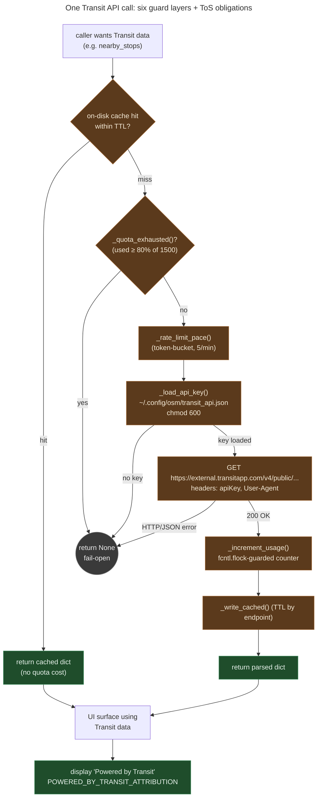

# Transit App quota: preserving 1,500 free calls/month against ToS

**Summary.** The Transit App API's free tier allows **1,500 calls per
month** and **5 calls per minute**. The Transit client is built around
quota preservation: aggressive on-disk caching with per-endpoint TTLs
(1 minute for real-time departures, 7 days for network-list metadata),
token-bucket pacing at the 5/minute cap, a `fcntl.flock`-guarded local
monthly counter, and a hard refusal at 80% quota
(`QUOTA_BUDGET_FRACTION`) so the project leaves headroom rather than
brownouts at month-end. Three Terms-of-Service obligations are
load-bearing: the **"Powered by Transit"** attribution string, the
project User-Agent, and the 10-business-day pre-release notice email
to `apis@transitapp.com`. Fail-open by design: any quota or network
error returns `None` and the main scan/fix path keeps running.

---

## What this is

Transit App provides operational transit data (real-time departures,
trip planning, network metadata) that supplements the static GTFS
data MetroNow already uses. The free-tier developer API has a hard
quota: 1,500 calls per calendar month, with a 5-call-per-minute rate
limit on top.

This client treats quota as a **non-renewable monthly resource**: each
call consumes from a finite pool that doesn't refill until the next
month. Three implications drive the design:

- **Caching is correctness, not performance.** A cache hit is free
  quota. The TTLs are per-endpoint because the freshness requirements
  vary by 4+ orders of magnitude (real-time arrivals: minutes;
  network metadata: weeks).
- **Concurrent processes can't share a counter naively.** The CLI
  and the web server can both invoke the client at the same time;
  unsynchronized counter writes would corrupt the count and lead to
  *quota underruns*: calling more than the quota allows. That's a
  ToS violation, not just a bug.
- **The maintainer should never see a "quota exceeded" error from
  Transit.** The client refuses internally at 80% so the project
  builds in headroom for the unexpected: a busy day at month-end,
  a script in a tight loop, anything that would otherwise spike
  usage to 100%+.

## How it works

The client has six load-bearing pieces. Each is a defense against a
specific way the project could lose quota or break ToS.

1. **API key at `~/.config/osm/transit_api.json` (chmod 600).**
   `_load_api_key()`
   ([transit.py:116](../../src/osm/transit.py#L116)) reads the JSON
   file with shape `{"api_key": "..."}`. Per the module docstring
   ([transit.py:20-22](../../src/osm/transit.py#L20-L22)), the key
   is never logged, never in error messages, never committed.
2. **Token-bucket pacing at 5/minute.** `_rate_limit_pace()`
   ([transit.py:146](../../src/osm/transit.py#L146)) sleeps when
   the per-minute window is saturated. The hard cap is per Transit's
   email at API-key issuance.
3. **Per-endpoint cache TTLs.** `TTL_BY_ENDPOINT`
   ([transit.py:78-92](../../src/osm/transit.py#L78-L92)) maps each
   of the 13 endpoints to its TTL: 7 days for `available_networks`
   (quarterly at most), 1 day for stop / route metadata, 5 minutes
   for `alerts_for_networks` (polling), 1 minute floor for
   `stop_departures` and `trip_details` (real-time).
4. **Monthly counter at `~/.config/osm/transit_api_usage.json`.**
   `_read_usage()` and `_increment_usage()` maintain a
   `{month: count}` map. The current month key is `YYYY-MM` per
   `_current_month_key()`
   ([transit.py:166](../../src/osm/transit.py#L166)). The increment
   is guarded by `fcntl.flock` on POSIX
   ([transit.py:204-234](../../src/osm/transit.py#L204-L234));
   Windows falls back to the unlocked path with a documented tradeoff
   (`docs/explainers/conventions.md` covers this rule in detail).
5. **80% budget cap.** `_budget_cap()` returns
   `int(MONTHLY_QUOTA_FREE_TIER * QUOTA_BUDGET_FRACTION)` = `1200`
   ([transit.py:194-196](../../src/osm/transit.py#L194-L196)).
   `_quota_exhausted()` returns `True` once the counter ≥ 1200, and
   `_request()` refuses to send the HTTP call. The remaining 300
   calls/month are reserve.
6. **Fail-open everywhere.** Any HTTP / JSON / quota / file error
   logs at warning level and returns `None` to the caller. The main
   scan/fix path treats `None` as "Transit data unavailable for this
   call" and continues without it. There's no scenario where a
   Transit failure stops a scan.

## The flow, visually

*What this shows: every Transit call has to pass cache → quota → rate
→ key → HTTP → counter-update → cache-write before returning real
data. Any guard can short-circuit to `None` (fail-open). The
attribution string is a separate, mandatory display obligation
whenever Transit data renders in the UI. What this hides: the
per-endpoint cache key derivation (`_cache_key()`), the per-endpoint
parameter shape, and the User-Agent header value (which is
load-bearing for ToS but uninteresting visually).*

## Why 80%, not 100%

The free tier is 1,500 calls/month. The naive cap is "refuse at 1,500
exactly." Three reasons not to:

- **Counter drift on Windows.** The `fcntl.flock` guard is POSIX-only;
  Windows falls back to unlocked writes
  ([transit.py:204-234](../../src/osm/transit.py#L204-L234)). On
  Windows, the local counter can drift slightly under concurrent
  load. A 1,500-cap with drift could submit calls Transit's
  server-side counter has already rejected.
- **Operational headroom.** Real-world usage is bursty. A scan run
  might be quota-cheap most days, then a tuning week pushes 200 calls
  in 24 hours. With a 1,500 cap, that burst could exhaust the month
  on the 28th. With a 1,200 cap, the burst still fits and there are
  300 calls of reserve for a "quick check" later.
- **Server-side discrepancy budget.** Transit's billing counter and
  this client's local counter can disagree by a few calls (network
  retries, server-side counting differences). 300 calls is
  generously beyond any reasonable disagreement.

The 80% number is a conservative default. A future paid tier or quota
uplift would reset the math: change `MONTHLY_QUOTA_FREE_TIER` and
`QUOTA_BUDGET_FRACTION` in `transit.py`; nothing else.

## Three ToS obligations the calling code MUST honor

These are not internal rules; they are Transit's explicit Terms of
Service ([transit.py:24-30](../../src/osm/transit.py#L24-L30)):

1. **"Powered by Transit" attribution.** Any UI surface that renders
   Transit data must display the string `POWERED_BY_TRANSIT_ATTRIBUTION`
   ([transit.py:73](../../src/osm/transit.py#L73)) verbatim. The Atlas
   footer ships it; new UI surfaces inherit the obligation.
2. **Project User-Agent.** Every HTTP call sends
   `MetroNow-OSM-Audit/0.1 (github.com/AICincy/MetroNow)`
   ([transit.py:67-69](../../src/osm/transit.py#L67-L69)). Identifies
   the project for traceability if Transit's ops team needs to reach
   us. Don't change it without notifying Transit.
3. **10-business-day pre-release notice.** Before any public release
   of a tool using this client, email `apis@transitapp.com`. The
   compliance email referenced in `CLAUDE.md` (sent to Richard at
   Transit App, awaiting reply on quota uplift) is exactly this
   obligation in action.

The full obligation list and runbook are in
[`docs/community-prep/05-transit-api-compliance.md`](../community-prep/05-transit-api-compliance.md).

## Edge cases and gotchas

- **Cache TTL of 60s for `stop_departures` is the floor, not the
  ceiling.** The TTL acts as a debounce, not a guarantee. Real-time
  arrivals genuinely need fresh data; the 60s minimum prevents
  thrash from rapid UI refreshes. Don't lower it without re-reading
  Transit's freshness expectations.
- **`available_networks` cache is 7 days because networks change
  quarterly at most.** Going lower wastes quota on stable data;
  going higher risks missing a SORTA service-area change. 7 days is
  the empirical sweet spot.
- **The fail-open posture is intentional.** A scan with Transit
  unavailable produces a complete result without Transit-specific
  enrichments. Don't add code that raises on Transit failures:
  it'll cascade into scan failures.
- **`_quota_exhausted()` is checked before EVERY call.** Not just
  the first one in a run. A long-running scan that crosses 80%
  partway through correctly stops calling Transit at that point.
- **The counter resets at month boundaries.** `_current_month_key()`
  returns `YYYY-MM` per the local timezone. Don't worry about
  edge-of-month UTC drift; Transit's monthly count uses calendar
  months too.
- **The User-Agent string includes the version `0.1`.** When the
  project versions up, this should follow. Static for now because
  there's no published version yet.
- **Don't put the API key in error messages.** The docstring
  emphasizes this
  ([transit.py:20-22](../../src/osm/transit.py#L20-L22)). When
  catching `requests.HTTPError`, log the status code and the URL
  *path*, never the request headers.

## Code references

- [`src/osm/transit.py:1-34`](../../src/osm/transit.py#L1-L34):
  module docstring with quota numbers and the three ToS obligations.
- [`src/osm/transit.py:56`](../../src/osm/transit.py#L56):
  `TRANSIT_BASE_URL`.
- [`src/osm/transit.py:59-61`](../../src/osm/transit.py#L59-L61):
  `RATE_LIMIT_PER_MINUTE = 5`, `MONTHLY_QUOTA_FREE_TIER = 1500`,
  `QUOTA_BUDGET_FRACTION = 0.80`.
- [`src/osm/transit.py:64`](../../src/osm/transit.py#L64):
  `AUTH_HEADER = "apiKey"` (per Transit's API doc).
- [`src/osm/transit.py:67-69`](../../src/osm/transit.py#L67-L69):
  `USER_AGENT`: required by ToS.
- [`src/osm/transit.py:73`](../../src/osm/transit.py#L73):
  `POWERED_BY_TRANSIT_ATTRIBUTION`: required attribution string.
- [`src/osm/transit.py:78-92`](../../src/osm/transit.py#L78-L92):
  `TTL_BY_ENDPOINT` (13 endpoints, TTLs from 60s to 7 days).
- [`src/osm/transit.py:95-97`](../../src/osm/transit.py#L95-L97):
  `KEY_FILE`, `USAGE_FILE`, `CACHE_DIR` paths under `~/.config/osm/`.
- [`src/osm/transit.py:104-110`](../../src/osm/transit.py#L104-L110):
  `TransitClientStatus` dataclass.
- [`src/osm/transit.py:116`](../../src/osm/transit.py#L116):
  `_load_api_key()`.
- [`src/osm/transit.py:146`](../../src/osm/transit.py#L146):
  `_rate_limit_pace()`.
- [`src/osm/transit.py:166`](../../src/osm/transit.py#L166):
  `_current_month_key()`.
- [`src/osm/transit.py:194-201`](../../src/osm/transit.py#L194-L201):
  `_budget_cap()`, `_quota_exhausted()`.
- [`src/osm/transit.py:204-234`](../../src/osm/transit.py#L204-L234):
  `_increment_usage()`: `fcntl.flock`-guarded counter.
- [`src/osm/transit.py:241`](../../src/osm/transit.py#L241):
  `status()`: public health check used by `osm transit-status`.
- [`docs/community-prep/05-transit-api-compliance.md`](../community-prep/05-transit-api-compliance.md):
  full ToS obligation list and maintainer's runbook.

## See also

- [`CLAUDE.md` § Layout / External feeds](../../CLAUDE.md):
  `transit.py` is listed as the Transit App client.
- [`docs/explainers/conventions.md`](conventions.md): covers the
  `fcntl.flock` rule that makes the quota counter safe under
  concurrent access.
- [`docs/explainers/phase-status.md`](phase-status.md): the Transit
  App quota tooling is shipped as a cross-cutting workstream; the
  ToS-compliance email is mentioned as awaiting reply.
- [Transit App API docs](https://api-doc.transitapp.com/v4.html):
  the upstream reference.
