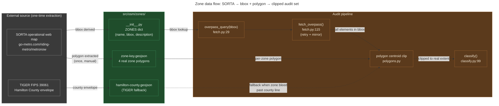

# Zone data flow: from SORTA's web map to a clipped audit set

**Summary.** A *zone* in MetroNow is one of four operational service areas
where SORTA runs the MetroNow on-demand microtransit service: Blue Ash /
Montgomery, Springdale / Sharonville, Northgate / Mt. Healthy, and Forest
Park / Pleasant Run. The pipeline ingests each zone as two artifacts: a
bounding box (used by the Overpass API) and a polygon (used to clip the
Overpass result down to the real spatial extent). Both come from SORTA's
operational web map. Plus a fifth fallback polygon (Hamilton County's
TIGER FIPS 39061 envelope) that exists to remove cross-county bleed when
a zone's bbox extends past the Hamilton County line. This explainer walks
the data flow from "SORTA web map" through to the clipped audit set the
classifier sees.

---

## What this is

A zone is *not* arbitrary. It corresponds to where SORTA actually
dispatches MetroNow vans, which is the population that benefits from
correcting OSM defects in that zone. The four zones cover almost all of
northern Hamilton County's residential street grid: exactly the area
TIGER's 2007-2008 import most badly damaged.

Each zone is represented in the pipeline as four pieces of data, all
defined in
[`src/osm/zones/__init__.py:11-37`](../../src/osm/zones/__init__.py#L11-L37):

- `name`: human-readable label (e.g. `"Blue Ash / Montgomery"`).
- `bbox`: `(south, west, north, east)` in WGS84 degrees. Used by the
  Overpass query.
- `description`: list of municipalities the zone covers.
- `index-case-street`: a known-defective TIGER street used as a
  smoke-test target during dev (only Blue Ash / Montgomery has one
  populated: `"O'Leary Avenue"`).

Each zone also has a corresponding polygon GeoJSON at
`src/osm/zones/<zone-key>.geojson`. The polygons were extracted from
SORTA's public operational web map at
[go-metro.com/riding-metro/metronow/](https://www.go-metro.com/riding-metro/metronow/).
A fifth polygon, `hamilton-county.geojson`, is the TIGER FIPS 39061
county-line envelope, used as a fallback clip when a zone bbox extends
past the Hamilton County boundary.

## How it works

The pipeline reads a zone in three stages: bbox → Overpass harvest →
polygon clip. Each stage discards data that doesn't belong, so the
classifier sees only ways genuinely inside the zone's operational area.

1. **Look up the zone.** `osm.zones.ZONES[zone_key]` returns the dict
   with `bbox`, `name`, `description`, `index-case-street`. The CLI
   default is `DEFAULT_ZONE = "blue-ash-montgomery"`
   ([zones/\_\_init\_\_.py:38](../../src/osm/zones/__init__.py#L38)).
2. **Build the Overpass query.** `osm.fetch.overpass_query(bbox)`
   ([fetch.py:29](../../src/osm/fetch.py#L29)) constructs a multi-clause
   Overpass QL query bounded by the zone's bbox. The default mode
   selects ways carrying `tiger:cfcc` (Census Feature Class Code, the
   canonical TIGER-origin marker), oneway-tagged residentials, the full
   driveable network, turn restrictions, barriers, bus stops, and
   building entrances: everything the classifier and detectors need in
   one query.
3. **Fetch with retry + mirror fallback.** `osm.fetch.fetch_overpass()`
   ([fetch.py:115](../../src/osm/fetch.py#L115)) hits the primary
   Overpass endpoint, waits 30s on failure, retries primary, then falls
   back to the kumi mirror. Each call uses `out meta geom` so every
   element returns with timestamp, version, user, uid, changeset, and
   full geometry: required by `osm.history_filter` to determine review
   state.
4. **Clip to the real polygon.** `osm.polygons` loads the zone's GeoJSON
   via `importlib.resources` (so it works from a wheel install, not just
   from a source checkout) and removes ways whose centroid falls outside
   the polygon ([polygons.py:1-18](../../src/osm/polygons.py#L1-L18)).
   This is the step that fixes Forest Park's Butler County bleed.
5. **Hand off to classify().** The clipped element list goes to
   `osm.classify.classify()` (see
   [`docs/explainers/detector-taxonomy.md`](detector-taxonomy.md)),
   which dispatches both classifier and detector tracks.

## The flow, visually

*What this shows: the bbox and the polygon take separate paths through
the pipeline. The bbox bounds the Overpass query (cheap, server-side,
returns more than we want); the polygon then clips client-side to the
actual operational area. The county envelope only kicks in when a
zone's bbox crosses the Hamilton County line: Forest Park is the only
zone where this matters in practice. What this hides: the
`importlib.resources` polygon loader, the Overpass cache layer
(`out_dir/data/`), the `import_only=True` path that uses
user/timestamp filters instead of `tiger:cfcc`.*

## Why the bbox-and-polygon split matters

A bbox is cheap to compute and cheap for Overpass to query, but it always
overshoots a real-shape area. The four MetroNow zones illustrate this
crisply:

- **Blue Ash / Montgomery**: bbox `(39.16, -84.44, 39.24, -84.33)`,
  a rectangle ~9 km × 10 km that includes some of southwestern
  Sycamore Township along the south edge. Polygon trim removes
  ~5-10% of the bboxed ways.
- **Forest Park / Pleasant Run**: bbox
  `(39.26, -84.56, 39.34, -84.46)` extends ~1 km north of the Hamilton
  County line into Butler County. Pre-clip, **78% of Forest Park's ways
  classified as F1 (no CAGIS candidate)** simply because CAGIS coverage
  ends at the county line, not because the geometry was wrong. Adding
  the polygon clip step pulled that F1 rate back into the normal range.

The polygon clip step is documented as Phase 4a stage 1 in the
[`polygons.py` docstring](../../src/osm/polygons.py#L1-L18). The
docstring explicitly notes that Forest Park drove the work: the bleed
was visible in baseline manifests as a sudden F1 spike that didn't
correspond to any real OSM defect.

## Edge cases and gotchas

- **Centroid containment, not full-geometry containment.** Ways
  straddling the county line are kept iff their centroid sits inside.
  Cheap, deterministic, "good enough for analysis." Per the
  `polygons.py` docstring, full-geometry intersection logic was
  deliberately rejected as overkill.
- **The polygons are not in a JOSM-friendly coordinate system.** They
  ship as standard GeoJSON in WGS84 (lon, lat): same as Overpass
  output, same as CAGIS feed. Any hand-editing of the GeoJSON should
  preserve this.
- **`importlib.resources` matters.** `osm` is pip-installable as a
  wheel, and zone polygons need to load from the wheel without
  filesystem path tricks
  ([zones/\_\_init\_\_.py:1-7](../../src/osm/zones/__init__.py#L1-L7)).
  Don't replace the `importlib.resources` loader with `open()`: it'll
  break the installed-package case and CI's wheel test
  ([ci.yml's wheel-bundles-templates check](../../.github/workflows/ci.yml)).
- **The `index-case-street` field is dev-only.** It's used during
  development to reproduce a known defect quickly. Three of the four
  zones have `None` because we haven't picked a canonical defect for
  them; this is fine: the field is informational.
- **TIGER FIPS 39061 vs. real polygons is intentional duplication.**
  Both ship in the package. The county envelope is fallback for any
  bbox bleed; the per-zone polygons are the primary clip. Future
  Phase 4a stage 2 may replace the per-zone polygons with CAGIS
  jurisdiction layers, but the county fallback should stay regardless.
- **Overpass uses bbox, not polygon.** Overpass QL supports polygon
  filters but they're slow and frequently rejected by mirrors at high
  query volume. Bbox + client-side polygon clip is the standard
  pattern in the OSM tooling community.
- **Adding a fifth zone requires four steps.** Add the entry to
  `ZONES` in `zones/__init__.py`, drop a `<key>.geojson` in
  `src/osm/zones/`, ensure the file follows the hyphen naming
  convention (no underscores), update CI's wheel-bundles-zones test
  to include it. There is no auto-discovery of zone GeoJSONs;
  `ZONES.keys()` is the authoritative list.

## Code references

- [`src/osm/zones/__init__.py:11-37`](../../src/osm/zones/__init__.py#L11-L37):
  the `ZONES` dict with bbox + name + description + index-case-street
  for each of the four zones.
- [`src/osm/zones/__init__.py:38`](../../src/osm/zones/__init__.py#L38):
  `DEFAULT_ZONE = "blue-ash-montgomery"`.
- [`src/osm/zones/blue-ash-montgomery.geojson`](../../src/osm/zones/blue-ash-montgomery.geojson):
  zone polygon (operational extent from SORTA's web map).
- [`src/osm/zones/hamilton-county.geojson`](../../src/osm/zones/hamilton-county.geojson):
  TIGER FIPS 39061 fallback envelope.
- [`src/osm/polygons.py:1-18`](../../src/osm/polygons.py#L1-L18):
  module docstring documenting the Phase 4a stage 1 polygon clip.
- [`src/osm/fetch.py:29`](../../src/osm/fetch.py#L29): `overpass_query()`
  builder. Takes `bbox` from `ZONES[zone_key]["bbox"]`.
- [`src/osm/fetch.py:115`](../../src/osm/fetch.py#L115): `fetch_overpass()`
  with retry + mirror fallback.
- [`src/osm/classify.py:99`](../../src/osm/classify.py#L99):
  `classify()` consumer of the clipped element list.

## See also

- [`CLAUDE.md` § Layout / Zone polygons](../../CLAUDE.md): the dense
  reference this explainer decompresses.
- [`docs/explainers/detector-taxonomy.md`](detector-taxonomy.md): what
  `classify()` does with the clipped element list.
- [`docs/explainers/conflation-matcher.md`](conflation-matcher.md): why
  the polygon clip was load-bearing for the matcher's F1 rate (Forest
  Park 78% → normal).
- [SORTA MetroNow service map](https://www.go-metro.com/riding-metro/metronow/):
  upstream source of the four zone polygons.
- [TIGER/Line 2024 boundary files](https://www.census.gov/geographies/mapping-files/time-series/geo/tiger-line-file.html):
  upstream source of the Hamilton County FIPS 39061 fallback envelope.
