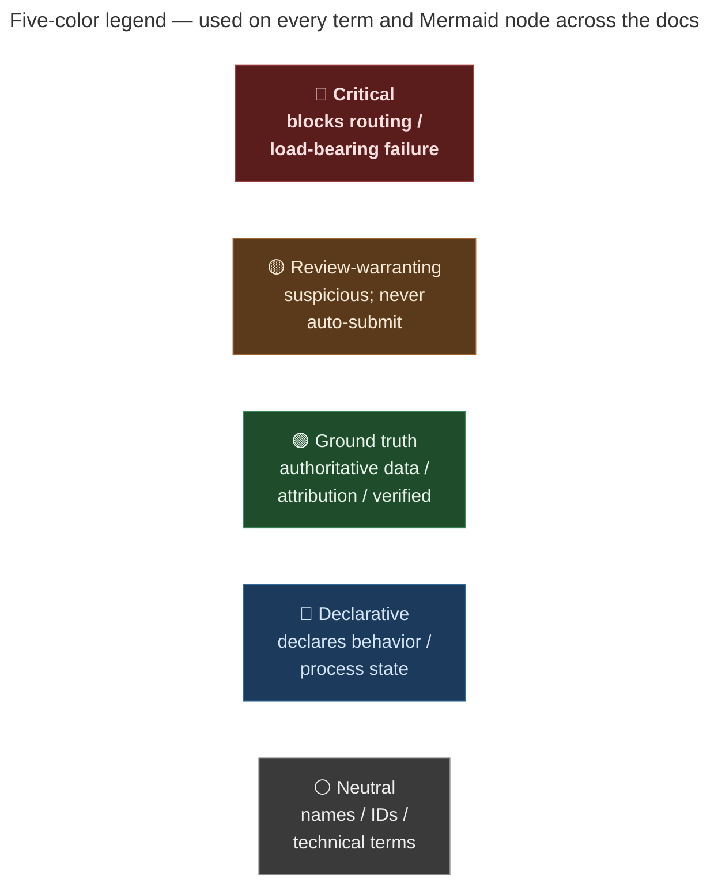

# Glossary

Every project-specific term, OSM tag, authoritative source, and
workflow concept used across the MetroNow docs surface. Skim this
once on cold re-entry; the rest of the docs assume you've decoded
the jargon here.

## Color-coding convention

Terms are prefixed with one of the five emoji markers below so the
category is visible at a glance. (Markdown doesn't support inline
text color reliably on GitHub; emoji do, and Mermaid `classDef`
covers the diagram side.)

| Marker | Category | What it means |
|---|---|---|
| 🔴 | **Critical / blocks routing** | Routing-blocking tag value or top-severity defect class. Treat as auto-submittable only with strong ground-truth backing. |
| 🟡 | **Review-warranting** | Suspicious tag value or finding that needs human eyes — never auto-submit. |
| 🟢 | **Ground truth / attribution** | Authoritative source data, license obligations, or verified-true values. |
| 🔵 | **Declarative / metadata** | Tags that declare behavior (mechanical=yes, bot=yes) or carry process state. |
| ⚪ | **Neutral / informational** | Names, IDs, technical terms with no severity charge. |

Mermaid diagrams across the docs use the same semantic mapping via
`classDef`: `critical` (red) / `judgment` (orange) / `safe` (green) /
`declarative` (blue) / `gate` (gray).

## OSM tags

Tags MetroNow's pipeline reads, writes, or treats as load-bearing.
"Truthy" means OSM treats `yes`, `true`, `1`, and `-1` all as
oneway-asserting (per `is_oneway_truthy()` in `classify.py:55`).

### 🔴 Routing-blocking tag values

- 🔴 `oneway=yes` (truthy) on `highway=residential` — the canonical
  Class A defect. Bus and microtransit dispatch refuses turns on
  what is almost always a bidirectional residential street.
- 🔴 `oneway=-1` — oneway in the *reverse* direction of way
  drawing. Looks like a tagging mistake but is sometimes
  intentional. The `oneway_minus_one` detector flags it; humans
  decide.
- 🔴 `access=no` / `access=private` on `highway=residential` —
  routing engines refuse the way entirely. The
  `access_blocked_residential` detector excludes
  `motor_vehicle=destination` (gated communities) from the flag.
- 🔴 `barrier=gate` / `barrier=bollard` etc. without an `access`
  qualifier — routing engines treat as impassable.

### 🟡 Review-warranting tag patterns

- 🟡 `tiger:cfcc` — Census Feature Class Code; the canonical
  TIGER-origin marker. Presence indicates 2007–2008 import
  provenance.
- 🟡 `tiger:reviewed=no` — *not trusted*. Cleanup bots strip it
  without fixing the geometry; humans leave it after fixing the
  data. See [`docs/explainers/history-filter.md`](explainers/history-filter.md).
- 🟡 `highway=residential` with arterial-suffix name (Boulevard,
  Parkway, Expressway, Pike, Highway, Crossing, Memorial) — flagged
  by `arterial_named_residential` detector.
- 🟡 `highway` ∈ {tertiary, unclassified} with no `maxspeed` —
  flagged by `missing_maxspeed_arterial` detector.

### 🟢 Ground-truth attribution tags

- 🟢 `cagis:attribution` — required on every changeset that uses
  CAGIS evidence per the Open Data Hub license. Value: the full
  attribution string from `conflate.py:76-79`.
- 🟢 `source=survey;CAGIS Open Data Hub` — declares evidence
  provenance for CAGIS-verified fixes.
- 🟢 `source=TIGER 2024` — declares evidence provenance for
  TIGER-verified fixes (always with `requires_human_review=True`).

### 🔵 Mechanical-edit declarative tags

- 🔵 `mechanical=yes` — declares the changeset as a mechanical
  edit per the OSM CoC. Required before any auto-submit run.
- 🔵 `bot=yes` — older OSMCha convention; emitted alongside
  `mechanical=yes` so all bot-flag filters catch the changeset.
- 🔵 `description=<wiki URL>` — links to the project's published
  wiki page documenting what edits the account performs.
- 🔵 `created_by=MetroNow TIGER Audit Pipeline/0.1` — identifies
  the tool that produced the changeset.
- 🔵 `comment` — per-batch human-readable summary.

### ⚪ Informational tags

- ⚪ `STRLABEL` (CAGIS) / `name` (OSM) — the same concept; CAGIS
  uses postal abbreviations, OSM uses spelled-out names. A
  mismatch always queues for human review.
- ⚪ `TRVL_DIR` (CAGIS) — direction of travel; overrides OSM
  `oneway` heuristic when CAGIS confidence ≥ 0.85.
- ⚪ `SPEEDLIMIT` (CAGIS) — supplies a missing OSM `maxspeed`.

## Project terms

### Defect classes (classifier track)

- 🔴 **Class AB** — `highway=residential/unclassified/tertiary/service`
  with truthy `oneway` AND a normalized name shared with ≥1 other way
  in the zone. Compound defect; CRITICAL severity; highest routing
  impact.
- 🔴 **Class A** — same as AB without the multi-segment
  co-occurrence. CRITICAL.
- 🟡 **Class B** — multi-segment shared name without false-oneway.
  HIGH severity; node-disconnect risk.
- ⚪ **Class C** — residual; in harvest, no Class A/B signal. LOW
  severity; not "all clear" — just no signal.

### Conflation buckets (CAGIS matcher state)

Defined at [`conflate.py:114-122`](../src/osm/conflate.py#L114-L122).

- 🟢 `MATCHED_HIGH` — confidence ≥ 0.85; eligible for mechanical
  auto-submission.
- 🟡 `MATCHED_REVIEW` — 0.6 ≤ confidence < 0.85, in-buffer
  (≤ 30 m); surfaces in human-review queue.
- 🟡 `MATCHED_FALLBACK_REVIEW` — out-of-buffer fallback (within
  100 m); confidence hard-capped at 0.6; never auto-submits.
- ⚪ `F1_NO_CANDIDATE` — no CAGIS centerline within 100 m at all.
- ⚪ `F2_NAME_FAIL` — geometry passes but name similarity < 0.5.
- ⚪ `F3_GEOMETRY_FAIL` — candidates exist, all have directed
  Hausdorff > 30 m. Was 70.5% of misses with symmetric Hausdorff;
  switching to directed dropped this materially.
- ⚪ `F4_DIRECTION_DRAG` — short way (< 50 m) where direction
  alignment killed an otherwise-passing match.
- ⚪ `MIXED_LOW` — confidence < 0.6 with no single dominant cause.

### Review status (history filter)

Defined at [`history_filter.py:16-19`](../src/osm/history_filter.py#L16-L19).

- 🔴 `UNREVIEWED` — no human editor has touched the way since
  the TIGER import. High confidence the way still carries
  import-era defects.
- 🟢 `LIKELY_REVIEWED` — at least one non-bot edit added a tag
  in the `TAGS_THAT_INDICATE_REVIEW` set. Lower defect-residual
  probability.
- ⚪ `INCONCLUSIVE` — couldn't fetch history, or human edits
  exist but no meaningful tag/geometry changes. Treated as
  UNREVIEWED downstream for safety.

### Phase status

- 🔴 **Phase 1** — community gating (wiki page, talk-us@,
  `_cincyimport` account, 14-day window). Currently blocked on
  human action.
- 🟢 **Phase 2** — conflation matcher. Shipped.
- 🟢 **Phase 3** — review tooling + MapRoulette. Shipped.
- 🟢 **Phase 4** — hardening (polygon clip, route-diff filter,
  detector tuning). Shipped.

## Authoritative sources

- 🟢 **CAGIS** — Cincinnati Area GIS, the Hamilton County Open
  Data Hub. Active ground truth for street centerlines
  (FeatureServer/26) and bus routes (FeatureServer/46). Per the
  Open Data Hub license, every CAGIS-sourced changeset must
  carry `cagis:attribution`.
- 🟢 **TIGER/Line 2024** — U.S. Census Bureau county roads;
  public domain. Fallback ground truth when CAGIS has no
  candidate. Less current and coarser-class than CAGIS;
  TIGER-verified fixes always `requires_human_review=True`.
- 🟢 **OSM Notes** — community-reported defects on the map.
  ODbL. Used for deduplication and `near_note` enrichment.
- 🟢 **Osmose-QA** — community quality-assurance project that
  flags issues against specific OSM elements. ODbL-derived.
  Used to skip fixes the community already has eyes on.
- 🟢 **SORTA GTFS feed** — `o-dngy-southwestohioregionaltransitauthority`
  (Onestop ID). Used by `misplaced_bus_stops` detector to
  validate `highway=bus_stop` placement.
- 🟢 **Mobility Database catalog** — registry that resolves
  the SORTA GTFS feed URL via `mdb-366`.
- 🟡 **ODOT TIMS Road Inventory** — *aspirational*, not yet
  integrated. Do **not** cite in `source=` tags until a working
  endpoint is wired.

## Workflow terms

- 🔴 **Mechanical edit** — defined by behavior, not tooling.
  Applying the same rule across many features without
  per-element human judgment. Subject to OSM's
  [Automated Edits CoC](https://wiki.openstreetmap.org/wiki/Automated_Edits_code_of_conduct).
- 🔴 **DWG** — Data Working Group. The OSM body that reverts
  non-compliant edits and suspends accounts. Reverts on sight
  for missing-wiki / missing-talk-us@ violations.
- 🟡 **Dry run** — `osm fix --dry-run`. Prints the exact
  changeset XML that would be submitted; does not call OSM API.
  Default-friendly mode.
- 🟡 **First-batch convention** — 10 elements maximum. Watch
  OSMCha 72 hours, then scale toward the ~500-element community
  norm. CGImap hard limit is 10,000 per changeset.
- 🟡 **Talk-us@** — `talk-us@openstreetmap.org` mailing list.
  Required posting venue before any mechanical edit in a new
  area. 14-day comment window mandatory.
- 🟢 **OSMCha** — community changeset-review tool at
  [osmcha.org](https://osmcha.org). Reviewers and DWG use it to
  spot non-compliant edits.
- 🟢 **MapRoulette** — community-review platform at
  [maproulette.org](https://maproulette.org). Where MetroNow
  sends Class A/AB findings that don't clear the auto-submit
  threshold.
- 🔵 **`_cincyimport` account** — naming convention for OSM
  accounts performing organised edits in Hamilton County.
  Precedent: the Hamilton County Building Import. The suffix
  is what OSMCha + DWG reviewers recognize.
- 🔵 **Pre-flight** — `osm preflight --zone <key>`. The 17
  codified readiness checks across 6 categories
  (PASS/FAIL/WARN/MANUAL).

## Routing concepts

- 🟢 **ViaMapping** — Via Transportation's custom OSM-derived
  routing layer. The intermediate between OSM and Via's
  ViaAlgo dispatch engine.
- 🟢 **ViaAlgo** — Via's dispatch engine. Consumes ViaMapping
  routing tiles for every MetroNow trip.
- ⚪ **BRouter** — public OSM-only routing engine at
  [brouter.de](https://brouter.de). The project's default
  routing engine for false-positive filtering. Car-only.
- ⚪ **MOTIS** — multi-modal routing engine
  ([motis-project/motis](https://github.com/motis-project/motis)).
  Opt-in via `MOTIS_BASE` env. Ingests OSM + GTFS in the same
  graph.
- 🟡 **`routing_impact`** — integer score 1–5 attached to every
  rider-impact detector finding. 5 = blocks an arterial-class
  route; 1 = noise. Atlas UI sorts by impact descending.

## Geographic concepts

- ⚪ **Bbox** — bounding box (south, west, north, east) in WGS84
  degrees. Cheap to compute, cheap for Overpass to query, but
  always overshoots a real-shape area.
- ⚪ **Polygon clip** — centroid-based containment check after
  Overpass harvest. Removes ways outside the real zone footprint
  (e.g., Forest Park's bbox bleed into Butler County). See
  [`docs/explainers/zone-data-flow.md`](explainers/zone-data-flow.md).
- ⚪ **Directed Hausdorff** — one-sided geometric distance metric.
  `max(min_dist(p, src) for p in osm_polyline)`. The geometry
  term in CAGIS conflation; directed (not symmetric) because
  OSM topology breaks long named streets into shorter ways at
  intersections.
- ⚪ **STRtree** — Shapely 2.x R-tree spatial index. Used by
  `osm.conflate` for fast bbox-based candidate retrieval over
  CAGIS centerlines.

## Acronyms

- **CGImap** — the OSM API server-side component. Hard limit:
  10,000 elements per changeset.
- **CoC** — Code of Conduct (specifically the OSM Automated
  Edits CoC).
- **CSP** — Content Security Policy (HTTP header). Atlas frontend
  uses strict CSP via `helmet`; `script-src` never includes
  `'unsafe-inline'`.
- **GTFS** — General Transit Feed Specification. Static schedule
  data format SORTA publishes.
- **NTD** — National Transit Database. Cross-references SORTA's
  feed (NTD ID 50012).
- **ODbL** — Open Database License. The license OSM and Osmose
  data are released under.
- **OOB** — Out-of-Band redirect URI (`urn:ietf:wg:oauth:2.0:oob`).
  OAuth pattern used by the project's auth flow because it has no
  webserver to receive a callback.
- **PKCE** — Proof Key for Code Exchange (RFC 7636). The OAuth 2.0
  extension that makes the auth flow safe without a true
  `client_secret`.

## See also

- [`CLAUDE.md`](../CLAUDE.md) — the dense context manifest;
  every term here is used somewhere there.
- [`docs/explainers/`](explainers/) — 13 hand-written
  decompression docs, each grounded in `file:line` citations.
- [`docs/sources.md`](sources.md) — external-source evaluation
  log (active, defensive backups, bookmarks, ruled-out).
- [`docs/cli-reference.md`](cli-reference.md) — every `osm`
  subcommand.
- [OSM Wiki — Map Features](https://wiki.openstreetmap.org/wiki/Map_features) —
  the canonical reference for OSM tag semantics.
