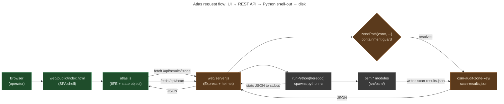

# Web architecture: Express server + vanilla SPA + shell-out-to-Python

**Summary.** The MetroNow Atlas frontend is **one HTML file** with
inline `<style>` (`web/public/index.html`), backed by a
**single Express.js REST API** at `web/server.js` that
shells out to the Python `osm` CLI via `child_process`. No
frontend framework, no bundler, no build step. The legacy pre-redesign
UI is preserved at `web/public/.legacy/` for rollback. Strict CSP via
helmet is the security perimeter, and `zonePath()` is the path-injection
guard.

---

## What this is

When the maintainer runs `node web/server.js`, an Express server binds
to port 3000 and serves two things:

1. **The Atlas UI**: `web/public/index.html` plus `js/`, `css/`,
   and tile assets. This is what the operator sees in their browser.
2. **A REST API**: `/api/scan`, `/api/conflate/:zone`,
   `/api/results/:zone`, `/api/fix-impact/:zone`, etc. Each handler
   either reads pre-computed scan output from disk or shells out to a
   Python heredoc that imports `osm.*` modules and returns JSON.

The Atlas is *not* a Single-Page App in the React/Vue sense: it's a
single HTML page with inline `<style>` and two external `<script>`
tags. atlas.js wraps everything in an IIFE; state lives on a global
`state` object that the IIFE closes over.

## How it's organized

| File | Role |
|---|---|
| `web/server.js` | Express REST API; helmet CSP; `zonePath()` guard; `runPython()` shell-out helper |
| `web/public/index.html` | Single-page UI shell; inline `<style>` block; loads atlas.js + atlas-extras.js |
| `web/public/js/atlas.js` | Main app logic; IIFE; global `state` object; Leaflet map; API calls; overlay panels |
| `web/public/js/atlas-extras.js` | Theme / density / accent / weight tweaks; loaded after atlas.js |
| `web/public/css/atlas-supplement.css` | CSS for components atlas.js adds at runtime |
| `web/public/.legacy/` | Pre-redesign UI preserved for rollback |

Frontend conventions:

- **Vanilla JS only.** No React, no Vue, no Svelte, no JSX. New
  framework dependencies need explicit discussion.
- **IIFE pattern.** `atlas.js` wraps in `(function () { ... })()`;
  module-level vars don't leak to global scope.
- **Global `state` object.** The single source of UI truth: current
  zone, scan-results data, map handles, layer toggles. All UI
  reactivity goes through `state`.
- **`escapeHtml()` is mandatory.** Every user-string-into-`innerHTML`
  path passes through it. No exceptions.
- **`$()` and `el()` helpers.** `$('.foo')` for query selectors,
  `el('div', {...attrs}, [...children])` for element creation.
  Don't reinvent.

Backend conventions:

- **Strict CSP via helmet.** `web/server.js:40-58`. `script-src` allows
  `'self'` plus unpkg.com (Leaflet); never `'unsafe-inline'`.
  `style-src` allows `'unsafe-inline'` because Leaflet injects inline
  styles for its controls.
- **`zonePath(zone, ...subparts)` for every per-zone path.**
  `web/server.js:140-149`. Resolves under `PROJECT_ROOT` and asserts
  containment to satisfy CodeQL's `js/path-injection` analysis at every
  call site.
- **`runPython(script)` for shell-outs.** Spawns `python -c <heredoc>`
  with a 5-minute timeout, project-root cwd. Each REST handler that
  needs Python composes a string of import statements + logic + final
  `print(json.dumps(...))`, then parses stdout.
- **No node modules in the server beyond Express + helmet.** New
  npm deps need explicit discussion.

## The flow, visually

*What this shows: two-tier dispatch. Reads (results / dashboard / fix-
impact / route-diff) hit the disk via `zonePath()`; writes (scan /
conflate / fix) shell out to Python which writes the JSON to disk and
reports stats. The Python process is short-lived per request: no
persistent Python worker. What this hides: the OAuth status endpoint
that reads `~/.config/osm/token.json`, the auth endpoints that
construct the OSM authorization URL, and the helmet CSP allow-list.*

## Why no framework

- **The UI is mostly Leaflet.** A map with overlays, layer toggles, a
  few panels. Leaflet IS the framework for the map, and the rest is
  light enough that vanilla DOM beats the dependency cost of React/Vue.
- **Solo maintainer.** A framework decision is a 10-year decision.
  vanilla JS + Leaflet has 10-year stability; React's API has shifted
  three times in that span.
- **No build step = no bundler bugs.** Edit the `.js`, refresh the
  browser. No webpack config, no Vite, no source maps to debug.
- **CSP-friendly.** Strict CSP forbids `script-src 'unsafe-inline'`;
  vanilla JS without a framework's runtime injection naturally
  complies.

## Edge cases and gotchas

- **`web/public/.legacy/` is the rollback target.** If the redesign
  breaks something fundamental, point Express at `.legacy/` instead of
  the current `public/` and the old UI returns. Don't delete `.legacy/`.
- **The 5-minute Python timeout in `runPython` is intentional.** Long
  scans (Forest Park, ~5,000 ways) approach 2-3 minutes. 5 minutes is
  generous headroom; longer would mask hung Python runs.
- **Helmet CSP allow-list mirrors the HTML.** When you add a new
  external origin to `index.html` (a new tile server, a new CDN), you
  MUST also add it to the helmet config in `server.js:40-58`. Otherwise
  the page silently fails to load the resource.
- **No WebSocket / SSE.** All client-server communication is
  request/response. Long scans return a synchronous response after
  Python finishes; the UI shows a spinner.
- **`zonePath()` must not be bypassed.** Every path under
  `osm-audit-<zone>/` MUST go through it. CodeQL's
  `js/path-injection` analysis flags any new sink that doesn't.
- **The frontend never imports Python.** The Python `osm` package is
  *only* invoked through `runPython`. There is no JS-Python interop
  beyond that boundary.

## Code references

- [`web/server.js:40-58`](../web/server.js#L40-L58): helmet CSP
  configuration.
- [`web/server.js:140-149`](../web/server.js#L140-L149): `zonePath()`
  containment guard.
- [`web/server.js:158-169`](../web/server.js#L158-L169): `runPython()`
  shell-out helper.
- [`web/public/index.html`](../web/public/index.html): single-page
  UI shell.
- [`web/public/js/atlas.js`](../web/public/js/atlas.js): IIFE main
  app.
- [`web/public/js/atlas-extras.js`](../web/public/js/atlas-extras.js):
  default-tweak loader.
- [`web/public/css/atlas-supplement.css`](../web/public/css/atlas-supplement.css)
 : runtime CSS.

## See also

- [`CLAUDE.md` § Layout / `web/`](../CLAUDE.md): the dense reference
  this overview decompresses.
- [`docs/explainers/conventions.md`](explainers/conventions.md):
  `zonePath()` and strict CSP rationale.
- [`docs/skills/metronow-javascript-review.md`](skills/metronow-javascript-review.md)
- [`docs/skills/metronow-html-review.md`](skills/metronow-html-review.md)
- [`docs/skills/metronow-css-review.md`](skills/metronow-css-review.md)
- [`docs/skills/metronow-dockerfile-review.md`](skills/metronow-dockerfile-review.md)
